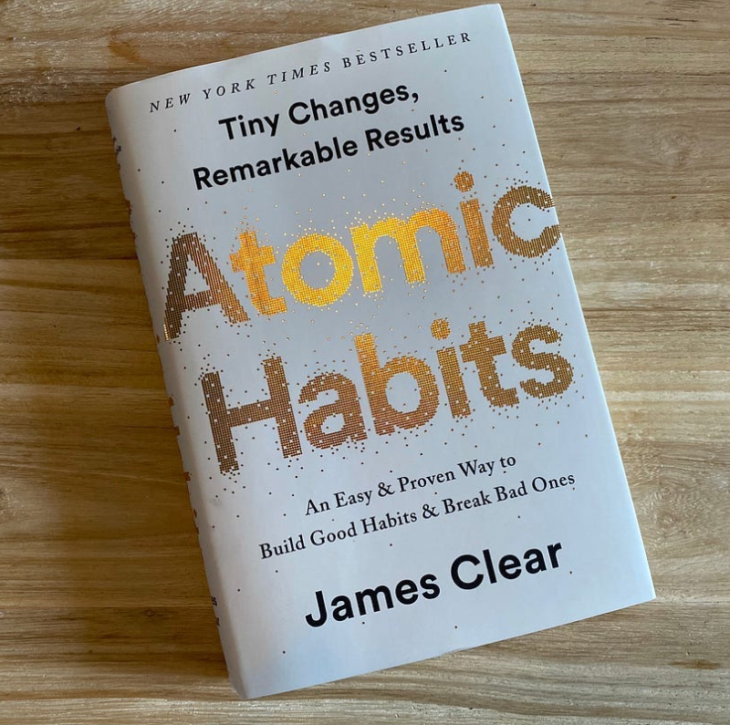
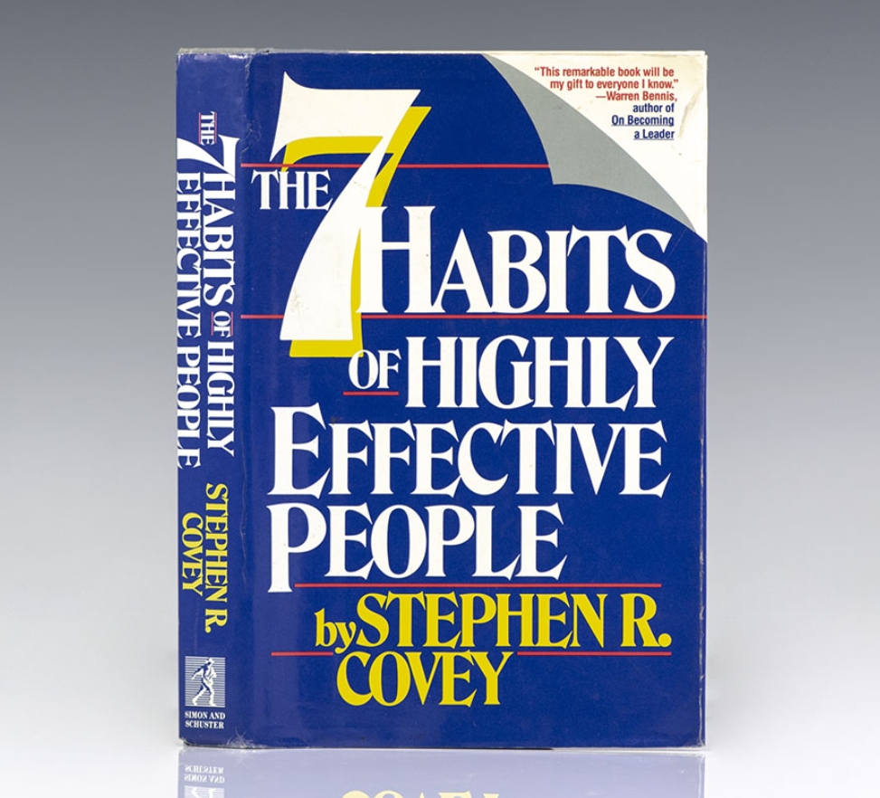
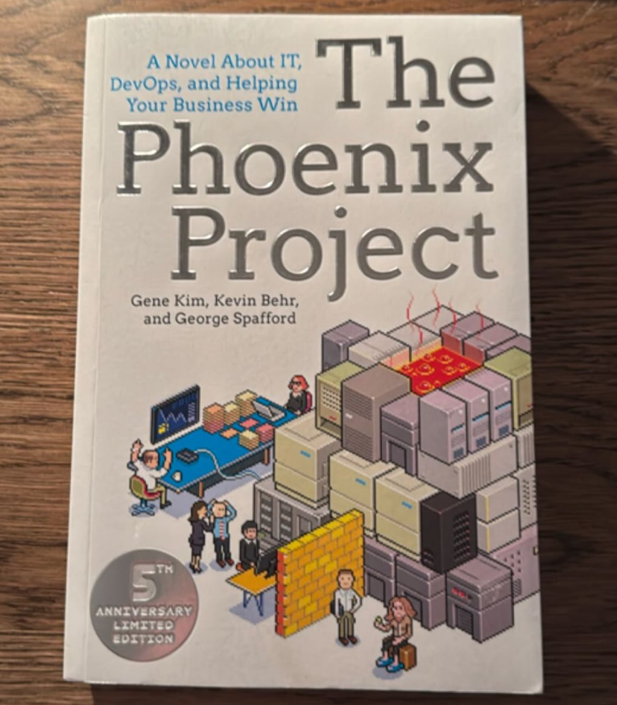
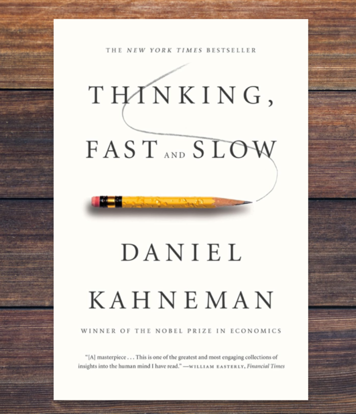
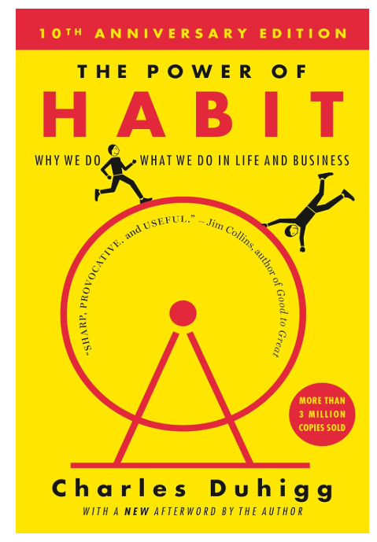
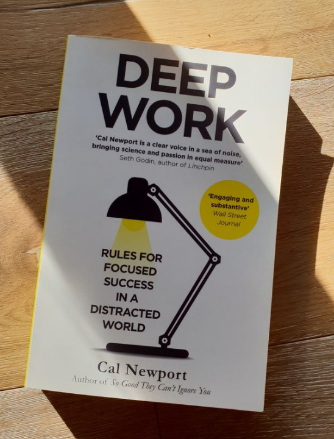
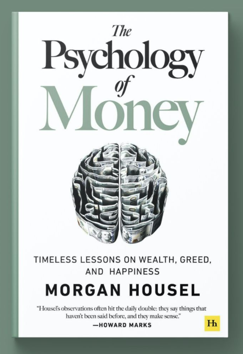
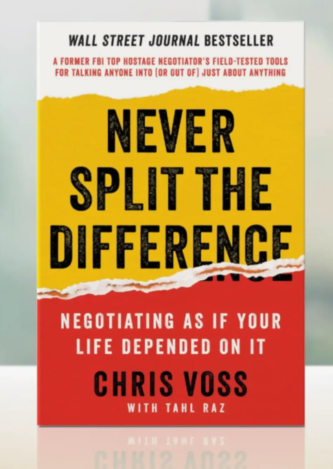
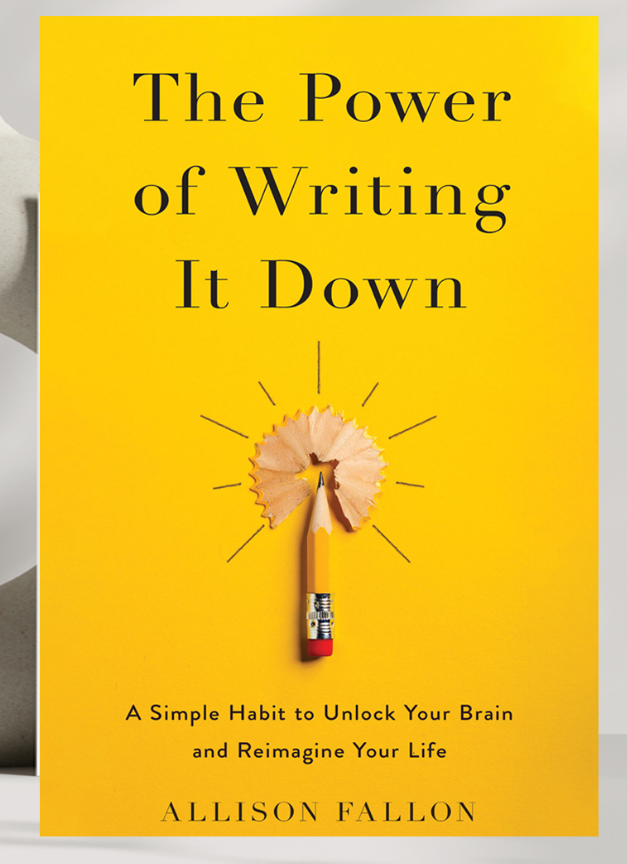

# Week 01 — Success Mindset (Mindset OS)

Part of the DevOps Micro Internship (DMI) Cohort 3 with Agentic AI

---

## Purpose (Read This First)

This week is not motivation homework.

This is you building your **Mindset OS** — the system you will use for the next 5 months (and honestly, for years).

### Expectations

* Be honest.
* Be specific.
* Be practical.
* Write like an adult professional: clear sentences, no one-liners.

You will reuse this in later weeks. So do it properly once.

---

# Assignment 1. What is something you believe to be true that most people around you would disagree with?

### Rules

* No "safe" answers.
* Must be your real belief (not copied from internet).
* Minimum 50 words.

**Hint:** What do you believe about career, money, learning, discipline, relationships, health, success, life, tech industry, etc. that most people don't agree with?

## Answer

What I believe when it comes to careers is that some people get opportunities more easily than others, while some people have to work much harder to get the same results. Just because someone gets a job that pays three times their current salary does not mean everyone else has to wait for that exact opportunity.
I believe we will eventually get to where we want to be if we keep pushing day by day, but for some people, taking baby steps is necessary. That does not mean settling for less. If you get a job opportunity that comes with only a small salary increase but offers valuable experience, career growth, learning opportunities, or exposure to new technologies, I believe it is worth taking rather than turning it down while waiting for something much bigger.
Many talented people miss out on good opportunities because they are waiting for the perfect one. We are all hoping for something bigger, but sometimes taking small steps is what helps us build the skills, experience, and confidence needed to reach those bigger opportunities.
Most people around me believe that if a job does not come with a huge salary increase, it is not worth taking. I disagree with that. I believe career growth is not always a straight path. Sometimes the smaller opportunities become the foundation for the bigger ones later on. I know it can be difficult when other people get oppotunites easily than others, but we have to keep pushing through and pray while we are on the journey.

---

# Assignment 2. What are the top 3 objective truths you discovered through experimentation and results?

### Definition

Objective truths do not depend on opinions. They hold true regardless of how people feel.

Write each truth in this format:

**Truth:** (1 sentence)

**Evidence from my life:** (2–4 lines: what you tried + what happened)

---

## Truth #1

### Truth

Not giving up even when you fail.

### Evidence from my life

There was a time when I was preparing for a certification exam. After weeks of studying and extensive reading, I failed the exam. The funny thing was that immediately i got back from the assessment, I rebooked the exam for the following month and started preparing again. Passing did not happen because I was smarter the second time; it happened because I stayed consistent and refused to give up.

---

## Truth #2

### Truth

Hands-on skills is better than getting certified in the tech industry.

### Evidence from my life

I spent time earning certificate and completing courses and doing some self learning. However, I discovered that hands-on projects stay with you much more, especially when you run into errors and have to troubleshoot. During interviews, I sometimes forget things, but I find it easier to answer questions about technologies I have actually worked with. Even if I go blank, I can still explain the problems I faced and how I solved them, which is often harder to do with topics I only studied without much practical experience.

---

## Truth #3

### Truth

Asking for help when you need it.

### Evidence from my life

Instead of trying to figure everything out on my own, I learned to reach out to other people when I get stuck. I remember struggling with Azure Policy for several days without making progress. I eventually asked a colleague who had experience with it, and she explained one concept in just one sentence. Everything immediately clicked, and I finally understood what I had been struggling with for days. That experience taught me that asking for help is not a weakness; it is part of learning.

---

# Assignment 3. What does your 2.0 version look like?

### Instructions

Write as if a journalist is writing about you **3 to 7 years from now** (not 20 years).

**Minimum 300 words.**

### Rules

* Write in past tense, like it already happened.
* Don't use "likes to / wants to / hopes to."
* Use specifics:

  * built
  * shipped
  * led
  * published
  * earned
  * relocated
  * contributed
* Include skills proof:

  * projects
  * portfolios
  * GitHub
  * blogs
  * certifications
  * job role
  * leadership
  * community contribution
* Add 1–3 images if you can (optional but powerful).

### Publish It Publicly On Any ONE

* LinkedIn
* Medium
* WordPress
* Blogspot
* Personal blog
* Portfolio page

Include this line:

> **P.S. This post is a part of DevOps Micro Internship with Agentic AI Cohort-3 by [Pravin Mishra](https://www.linkedin.com/in/pravin-mishra-aws-trainer/). You can start your DevOps journey by joining this [Discord community](https://discord.pravinmishra.com/) ( https://discord.pravinmishra.com/ ).**

## Your Article

In 2030, Zahra'u Nura Musa became well known in the cloud engineering community as a Senior Site Reliability Engineer and Infrastructure Engineer. She also co-founded a team that built an application for the agricultural sector, which is now being used in several countries to improve farming operations and decision-making. Starting from a technical support background, she gradually built her career through consistent learning, hands-on experience, and continuous improvement.
Her passion for mentoring also became one of the things she is recognized for. She mentored hundreds of people who were transitioning into cloud engineering and built a strong community around them. She started this journey by consistently posting every week on platforms like LinkedIn, YouTube, Medium, and X (formerly Twitter), where she shared her learning, career experiences, technical tutorials, and interview preparation tips. Over time, people began following her content not only because of her technical knowledge but because she explained complex cloud concepts in a simple and practical way. Her community grew through genuine engagement and a willingness to help others succeed.
She was also invited to speak at several conferences around the world, where she shared her experiences in cloud engineering, Site Reliability Engineering, and emerging cloud technologies. Her talks focused on practical lessons, automation, reliability, and encouraging more women to pursue careers in technology.
Over the years, she led several cloud migration and infrastructure automation projects, helping organizations improve reliability, monitoring, and deployment processes. She built Infrastructure as Code solutions using Terraform and Azure Bicep, implemented monitoring solutions with Azure Monitor, AWS CloudWatch, and Grafana, and contributed to reducing system downtime through automation and proactive monitoring.
Her GitHub portfolio grew to include projects involving Azure, Kubernetes, Terraform, and CI/CD pipelines. She also published technical articles and tutorials documenting her learning journey, troubleshooting experiences, and best practices in cloud engineering. These articles became valuable resources for engineers transitioning into Cloud and Site Reliability Engineering roles.
As her experience grew, she brought together a team of talented engineers to build an application focused on solving challenges in the agricultural sector. What started as an idea eventually became a product adopted in several countries, helping farmers and agricultural organizations make better decisions using technology.
One of the major turning points in her career was completing a DevOps Micro Internship in 2026. That experience reshaped her mindset, gave her confidence, and helped her redefine her career goals. It pushed her to become more intentional about learning, building projects, sharing knowledge publicly, and taking on opportunities that challenged her.
Her journey also inspired many young women, especially those from Northern Nigeria, to believe they could build successful careers in technology. She became living proof that where you start does not determine where you finish.
None of these achievements happened overnight. She got there by studying consistently after work, building personal projects, documenting what she learned, applying for opportunities even when she did not feel completely ready, and asking for help whenever she got stuck. She accepted roles that offered growth, even when they were not perfect, knowing that every experience was another step toward the career she had envisioned years earlier.
P.S. This post is a part of DevOps Micro Internship with Agentic AI Cohort-3 by Pravin Mishra. You can start your DevOps journey by joining this Discord community ( https://discord.pravinmishra.com/ ).

### Public Link

Paste your link here: 

`https://medium.com/@lalanura5/zahrau-nura-2-0-45449b1592ab`

---

# Assignment 4. Have you ever cut corners (unethical / dishonest / shortcut behavior — not necessarily illegal)? If yes, how did it make you feel?

### Important

You don't need to write the full story.

Focus on the feeling:

* guilt
* fear
* shame
* stress
* regret
* numbness
* etc.

This is about self-awareness, not judgment.

### Answer Format

**Yes / No**

If Yes:

**What emotion did you feel?** (minimum 50–100 words)

## Answer

Yes.
The main emotions I felt were guilt and discomfort, but I also experienced stress and regret along the way. I realized that taking shortcuts only gave me temporary relief, whether it was to finish a task quickly or get through a challenge. In the end, I still had to go back and do things the right way, so the shortcut did not really save me much.
I kept thinking about whether I had truly earned the result or if I had just avoided putting in the work. That feeling stayed with me much longer than the time I thought I had saved. It also made me realize that shortcuts slow down real learning because they prevent you from gaining the experience and confidence that come from working through problems yourself.
Since then, I have tried to be more intentional about following the right process, even when it is difficult or when an easier shortcut is available. It is not always the easiest decision, but I have learned that the peace of mind, the knowledge I gain, and the confidence that comes from doing things properly are worth far more than any temporary shortcut.

---

# Assignment 5. What are 10 non-fiction books you plan to read in the next 1 year?

### Rules

* Mention **Title + Author**
* Any language allowed
* No fiction novels

### Tip

Choose books that improve:

* mindset
* communication
* productivity
* health
* money
* career
* leadership

## Book List

1. The 5AM Club By Robin Sharma

2. Atomic Habits  by James Clear

3. The 7 Habits of Highly Effective People by Stephen R. Covey

4. The Phoenix Project by Gene Kim, Kevin Behr & George Spafford

5. Thinking, Fast and Slow by Daniel Kahneman

6. The Power of Habit by Charles Duhigg

7. Deep Work by Cal Newport

8. The Psychology of Money by Morgan Housel

9. Never Split the Difference by Chris Voss

10. The Power of Writing It Down by Allison Fallon

---

# Assignment 6. What are the things you will measure regularly in your life and career?

### Rules

List topics only. No need to share numbers.

### Must Include

* Learning / skill
* Output / proof
* Health / energy
* Time / focus
* Money / finance (personal or business)

### Example

* Learning hours per week
* Deep work sessions per week
* Projects shipped / documented
* Steps / workouts
* Sleep hours
* Spending tracker

## My Metrics

* Learning hours per week
* Exercise or walking
* Screentime and distraction
* Networking with other engineers
* Monthly savings
* Water Intake
* Projects completed
* Sleep hours
* Published article
* Stress level

---

# Assignment 7. Brain Dump + 5-Month System Plan

## Step 1: Brain Dump (Private)

Do a brain dump of everything in your mind into a notebook.

Examples:

* Bills
* Tasks
* Worries
* Goals
* Pending messages
* Ideas
* Responsibilities

### Did You Do It?

**Yes / No**

Answer:

Yes

---

## Step 2: Your 5-Month Routine + Focus Blocks

Create a simple plan you can realistically follow for the next 5 months.

### Weekly Routine

Example:

* Mon–Thu: 60 min deep work
* Sat: DMI session
* Sun: Weekly review

#### My Weekly Routine

My 5-Month Weekly Routine

Monday – Thursday: 5 - 8 hours of Deep work learning and Hands-on labs. Read technical articles or documentation.

Friday: Reset for the week or work on any outstanding task.

Saturday: DMI session

Sunday: Weekly review on the DMI session. Plan the coming week learning objectives

---

### Focus Blocks

#### When Will You Do DMI Work? (Days + Time)

Monday – Thursday: 11:00 AM - 01: 00 PM or 6:00 PM – 8:30 PM
Saturday: 5:30 AM DMI Session
Sunday: 4:00 PM – 5:00 PM (weekly review and planning)

#### How Many Sessions Per Week?

6 sessions per week

---

### Distraction Rules

Examples:

* Phone rules
* Social media rules
* Environment setup

#### My Distraction Rules

1. Keep my phone on *Do Not Disturb* during focus sessions.
2. Stay off social media until my study or work session is complete.
3. Take a 10–15 minute break after every 90 minutes of focused work.
4. Write down unrelated thoughts or tasks instead of switching focus to them immediately.

---

# Reflection – Week 1

### Biggest insight I got about myself this week

I realized that I am more disciplined than I give myself credit for. Looking back at my journey, I have always found a way to keep going, even after setbacks. Whether it was failing a certification exam, preparing for interviews, or learning new technologies, I never stopped. I just needed to remind myself that progress is built over time, not overnight. I also realized that consistency has played a bigger role in my growth than talent alone.

### My biggest weakness/loop I noticed

One thing I noticed is that I sometimes overthink and wait for the "perfect" opportunity instead of making the most of the opportunity in front of me. I also spend too much time trying to figure things out on my own before asking for help. While being independent is a good thing, I have learned that asking the right person at the right time can save hours, or even days, of frustration.

### One system I will implement from this week (exact habit + time)

From Monday to Thursday, I will dedicate a cumulative 5–8 hours each week to deep work for learning. During that time, I will focus on my task for the week, whether it is studying, building projects, or completing my internship assignments. My phone will be on **Do Not Disturb**, and I will stay away from social media until my session is complete.

### LinkedIn Post

Paste your LinkedIn post link here:

`https://www.linkedin.com/posts/zahra-u-nura_join-the-dmi-devops-micro-internship-share-7478432800833183744-XmTa/?utm_source=share&utm_medium=member_desktop&rcm=ACoAABhheJ4Bw5LI3hMBUfCD5MZiGRXdKYKjr0U`

---

## 10. Proof of Work

- LinkedIn Post URL: **https://www.linkedin.com/posts/zahra-u-nura_join-the-dmi-devops-micro-internship-share-7478432800833183744-XmTa/?utm_source=share&utm_medium=member_desktop&rcm=ACoAABhheJ4Bw5LI3hMBUfCD5MZiGRXdKYKjr0U**  
- Blog / Medium : **https://medium.com/@lalanura5/zahrau-nura-2-0-45449b1592ab**  

---

## 📌 About DMI & CloudAdvisory

DevOps Micro Internship (DMI) is a project-based DevOps program run by Pravin Mishra (The CloudAdvisory) focused on real-world execution, systems thinking, and career readiness.

It helps learners build strong DevOps foundations with hands-on experience.

## 📌 Resources

- 🌐 **DMI Official Website:** https://pravinmishra.com/dmi  
- 🎓 **DevOps for Beginners (Udemy):** https://www.udemy.com/course/devops-for-beginners-docker-k8s-cloud-cicd-4-projects/  
- 🎓 **Ultimate Agentic AI DevOps with Clude Code** https://www.udemy.com/course/ultimate-agentic-ai-devops-with-claude-code/?referralCode=448389767BC96284087B
- 🎓 **DevOps with Claude Code: Terraform, EKS, ArgoCD & Helm** https://www.udemy.com/course/devops-with-claude-code-terraform-eks-argocd-helm/?referralCode=1C5B734505D65A010FA3
- ▶️ **YouTube Playlist (DMI Cohort 3):** https://www.youtube.com/playlist?list=PLFeSNDtI4Cho  
- 🔗 **Pravin Mishra (LinkedIn):** https://www.linkedin.com/in/pravin-mishra-aws-trainer/  
- 🏢 **CloudAdvisory (LinkedIn):** https://www.linkedin.com/company/thecloudadvisory/

---

*This submission is part of DevOps Micro Internship (DMI) Cohort 3 — Agentic AI Track*