# Assignment 3 — Production Maintenance Drill (OPS Checklist)

Part of the DevOps Micro Internship (DMI) Cohort 3 with Agentic AI

---

## Purpose

In this assignment, you will treat your already deployed React application (on Ubuntu VM with Nginx) as a live production system. You will perform structured operational checks covering network validation, service health, log analysis, resource monitoring, configuration verification, and incident simulation with recovery — mirroring real on-call DevOps responsibilities.

---

# Task 1 — Server Access & Networking Validation

## Goal

Verify that the deployed React application is reachable from the browser and confirm basic network connectivity of the Ubuntu VM.

### Evidence

#### Screenshot 1 — Browser showing the React app with your Full Name visible on the UI

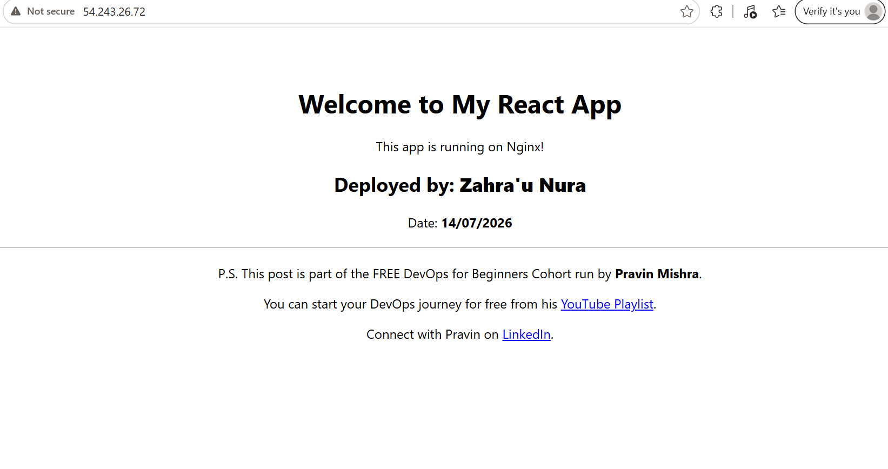.

---

#### Screenshot 2 — Output of `ip a`

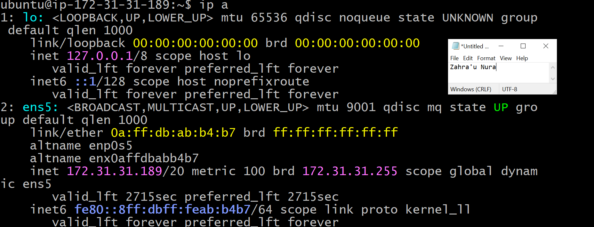

---

#### Screenshot 3 — Output of `sudo ss -tulpen`

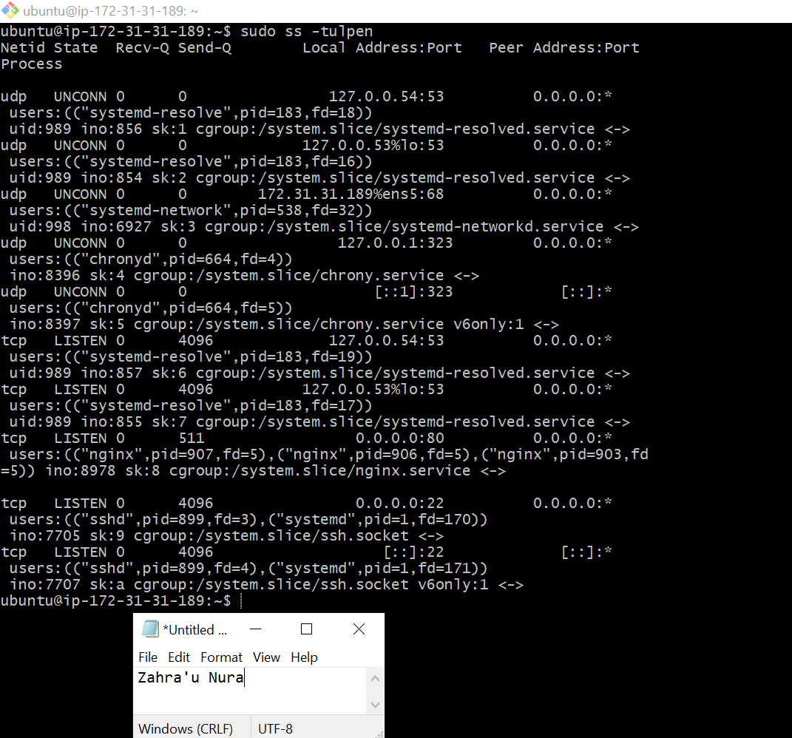

---

#### Screenshot 4 — Output of `sudo ufw status`

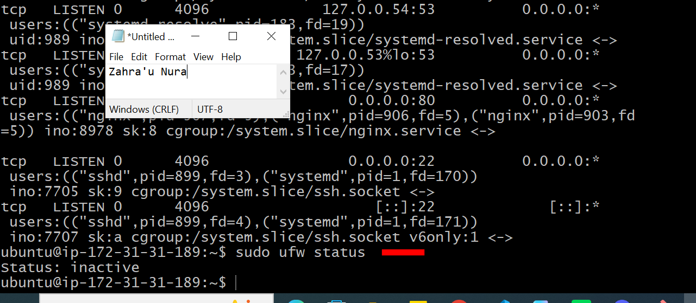

---

### Notes

Answer the following in your own words:

**1. What proves Nginx is listening on 0.0.0.0:80?**

When you run the command s"udo ss -tulpen" on linux machine the output should conatin "tcp LISTEN 0.0.0.0:80 ... nginx", this shows that Nginx is actively listening for HTTP traffic on port 80,and 0.0.0.0 across all network interfaces not restrcitred to any IPs.

---

**2. What proves SSH is active on port 22?**

When you run the command s"udo ss -tulpen" on linux machine the output should conatin "cp LISTEN 0.0.0.0:22 ... sshd", this shows that SSH is actively listening on port 80,and 0.0.0.0 across all network interfaces not restrcitred to any IPs.

---

**3. Did you find any unexpected open ports? Explain briefly.**

None was found.

---

# Task 2 — Service Health & Systemd Validation (Nginx)

## Goal

Verify that Nginx is properly installed, running, enabled at boot, and safely configured.

### Evidence

#### Screenshot 1 — Output of `systemctl status nginx --no-pager`

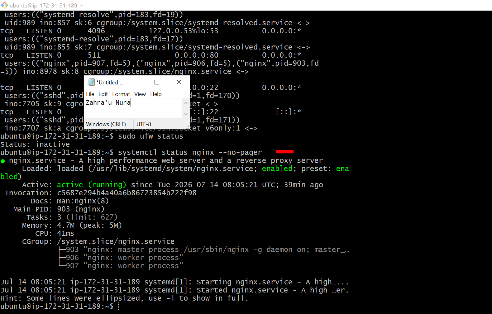

---

#### Screenshot 2 — Output of `sudo nginx -t`

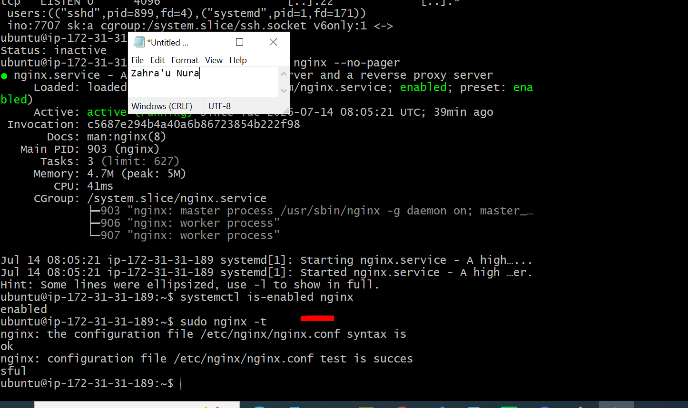

---

#### Screenshot 3 — Output of `sudo ss -lptn '( sport = :80 )'`

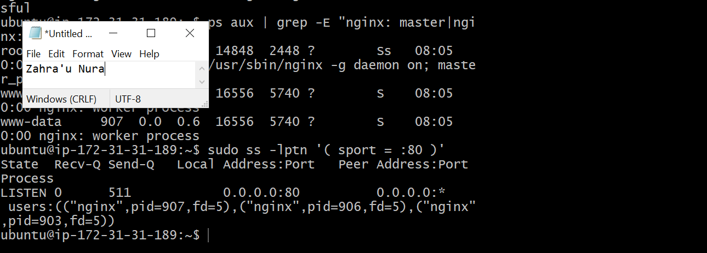

---

### Notes

Answer the following in your own words:

**1. What happens if Nginx fails to restart in production?**

If Nginx fails to restart in productin you will experience downtime, the server will drop all incoming web traffic as site can not be reachable.

---

**2. What's your basic rollback plan?**

A rollback plan will be reverting to the last wrking configuration. Always test configuration with the command "sudo nginx -t".

---

# Task 3 — Logs & Request Trace

## Goal

Verify real traffic flow and analyze logs to understand system behavior and errors.

### Evidence

#### Screenshot 1 — Output of `sudo tail -n 30 /var/log/nginx/access.log`

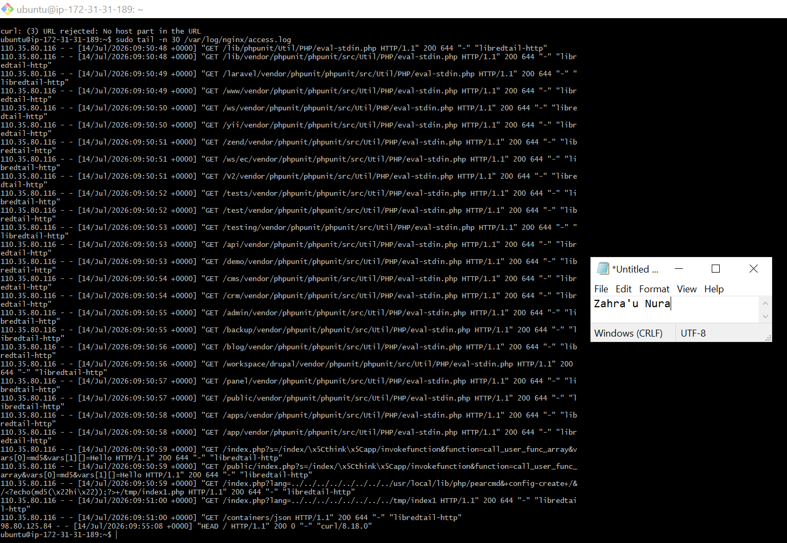

---

#### Screenshot 2 — Output of `sudo tail -n 30 /var/log/nginx/error.log`

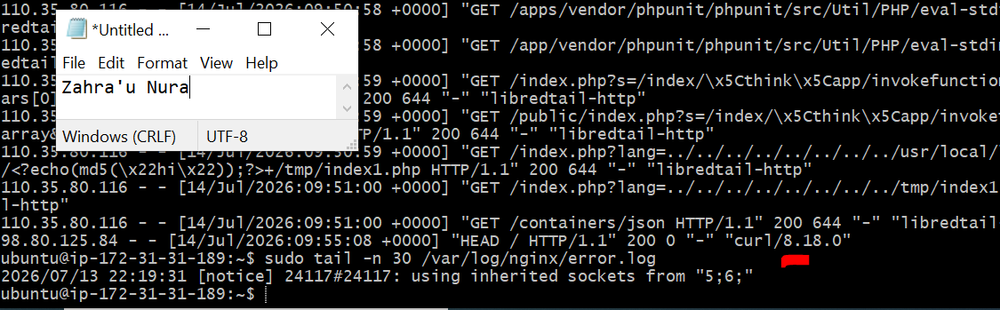

---

#### Screenshot 3 — Output of `sudo journalctl -u nginx --no-pager -n 50`

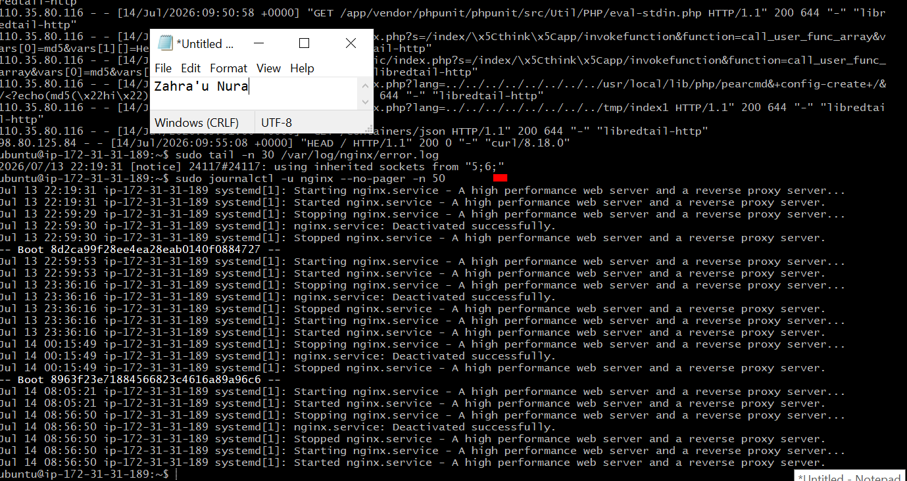

---

### Notes

Answer the following in your own words:

**1. Were there any errors in the logs?**

- If yes, mention 1–2 example error lines from the logs and explain what each one means in simple terms.
- If no, explain what it means if the error log is empty or shows no recent errors during your check.

No erros, and all logs indicate everything is working as expected.

---

**2. If there were no errors, what does that indicate about the system?**

Everything is working as expected. The output received indicates that Nginx started or reloaded successfully.

---

**3. Based on the access logs, were your curl requests visible in the log entries? What does that prove about traffic flow?**

Yes, all logs were GET http request with 200 status response code. This indicates that there are no issues with the traffic.

---

# Task 4 — System Resource Health Check (Capacity Red Flags)

## Goal

Assess server capacity and detect potential performance or failure risks.

### Evidence

#### Screenshot 1 — Output of `uptime`

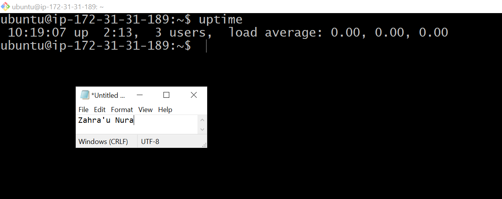

---

#### Screenshot 2 — Output of `free -h`

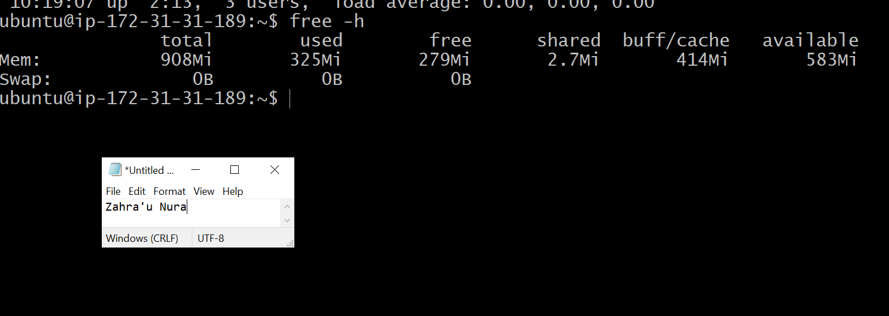

---

#### Screenshot 3 — Output of `df -h`

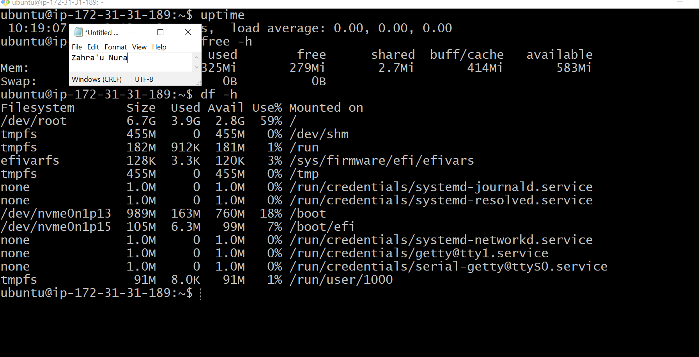

---

#### Screenshot 4 — Output of `sudo du -sh /var/* | sort -h`

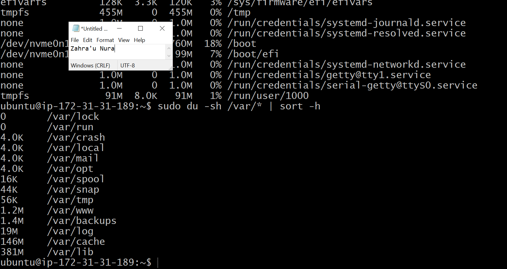

---

### Notes

Answer the following in your own words:

**1. Which resource looks most critical right now? (CPU/load, memory, or disk) Explain why.**

None are in any critical state at this moment but the disk deserve some attention. CPU usage is very low, with a load average of 0.00, indicating the server is almost idle. Memory usage is also healthy, with 583 MiB still available out of 908 MiB. However, the root filesystem is already 59% full (3.9 GB used out of 6.7 GB) this is not an issue but it should be monitored. .

---

**2. What happens if disk becomes 100% full in a production server?**

If the disk reaches 100% capacity, the server can experience serious issues. Applications may fail because they cannot write log files, temporary files, or new data. Services such as databases, web servers, and package managers may stop working correctly, updates may fail, and users could experience application errors or downtime.

---

# Task 5 — Configuration & Deployment Verification

## Goal

Ensure the correct React build is deployed and Nginx is serving it properly.

### Evidence

#### Screenshot 1 — Output of `ls -lah /var/www/html | head -n 20`

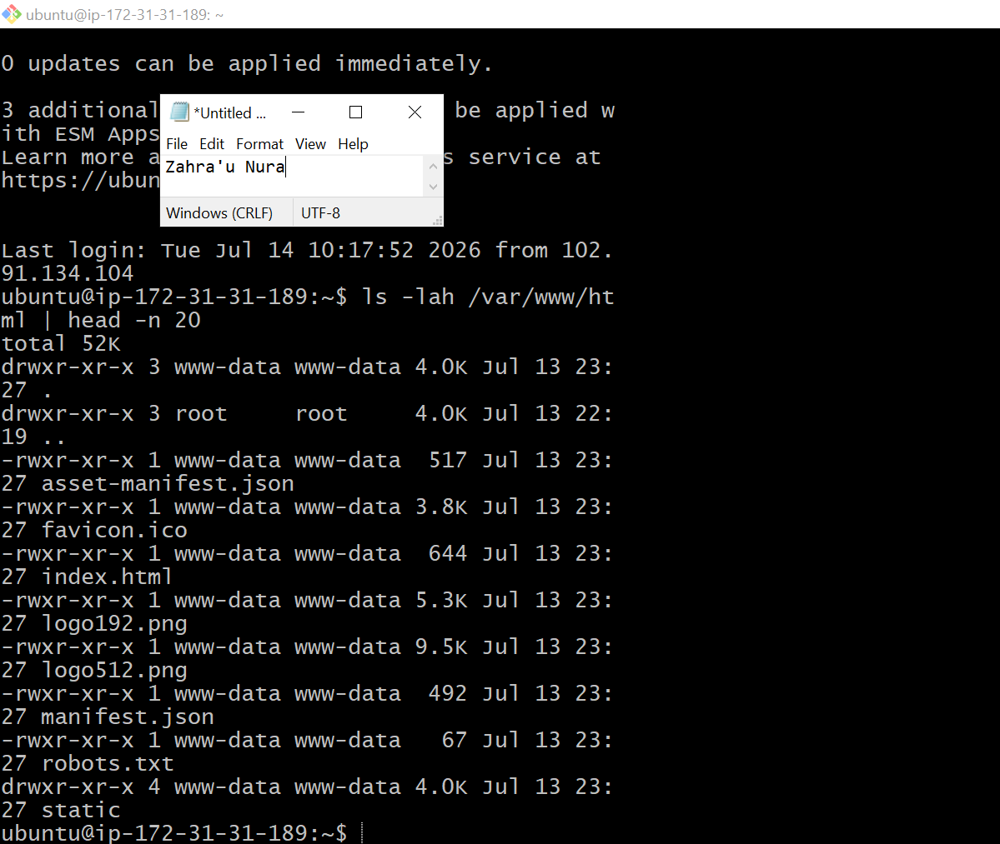

---

#### Screenshot 2 — Output of `grep -R "Deployed by" -n /var/www/html 2>/dev/null | head`

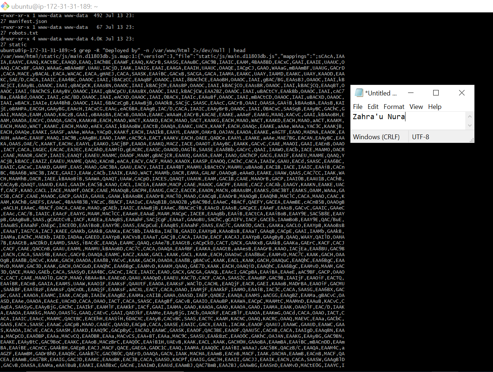

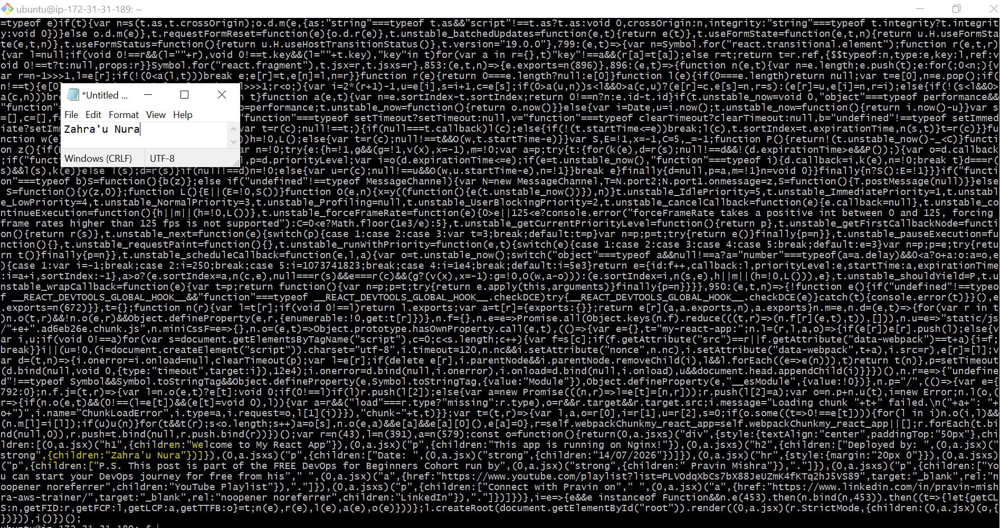

---

#### Screenshot 3 — Output of `grep -n "try_files" /etc/nginx/sites-available/default`

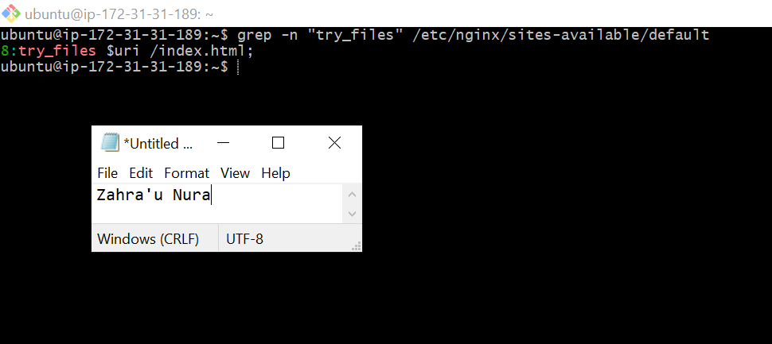

---

### Notes

Answer the following in your own words:

**1. How do you confirm that the correct version of the application is deployed?**

First, I checked the contents of the Nginx web root using:  ls -lah /var/www/html
This confirmed that the React production build had been copied successfully. I verified that the required build artifacts, including the index.html file and the static/ directory, were present. I confirmed that my custom deployment change was included by checking the deployed files for the "Deployed by Zahra'u Nura" line. This verified that the latest build containing my changes had been deployed rather than an older version. I also ensured that Nginx was serving the application from the correct web root (/var/www/html) by verifying the Nginx configuration and confirming it pointed to the React build directory.

---

# Task 6 — Nginx Configuration Failure Simulation

## Goal

Simulate a real-world Nginx misconfiguration and recover the service safely.

### Evidence

#### Screenshot 1 — Output of `sudo nginx -t` showing the syntax error (broken config)

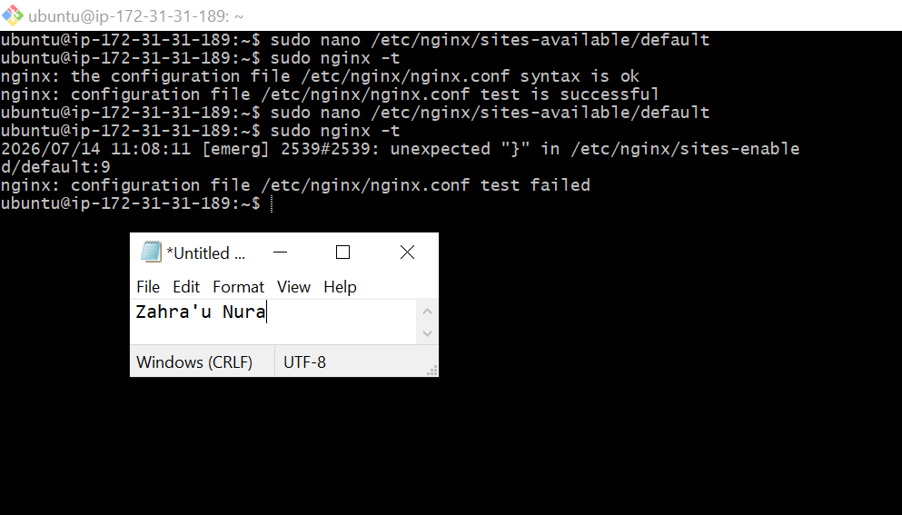

---

#### Screenshot 2 — Output of `sudo nginx -t` showing syntax ok (fixed config)

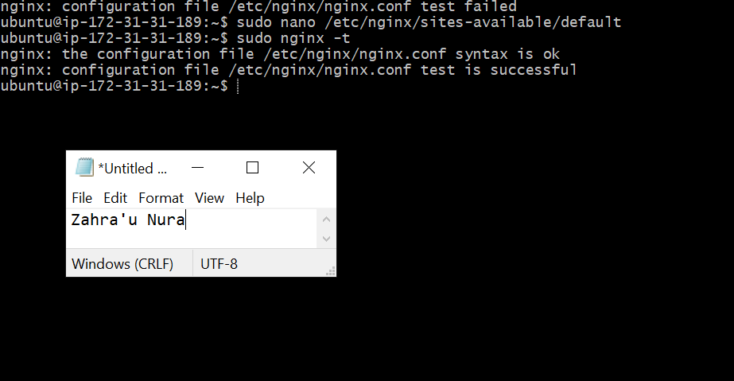

---

#### Screenshot 3 — Output of `curl -I http://<public-ip>` confirming recovery (200 OK)

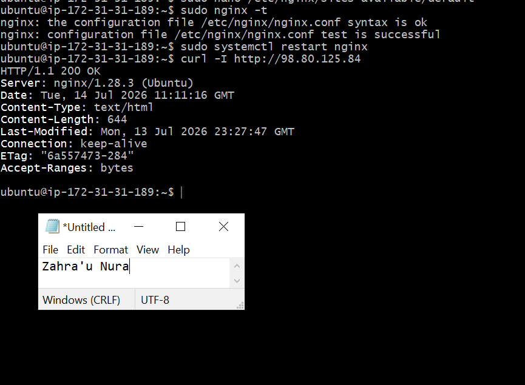

---

### Notes

Answer the following in your own words:

**1. What caused the configuration failure?**

A missing semicolon in /etc/nginx/sites-available/default which was intentionally remove to test out the output.

---

**2. How did you fix the issue?**

Restoring the semicolon that was removed in the in /etc/nginx/sites-available/default.

---

**3. How can you avoid this kind of issue in real production systems?**

Before any update in been pushed it should be reviewed very carefully, a staging environement can be introduced. Also test out the config file before any deployment. Where possible, automate config validation as part of a deployment pipeline, so a broken config is caught in CI and never reaches the live server at all.

---

# Task 7 — Web Application Failure Simulation

## Goal

Simulate missing deployment content and recover the application safely.

### Evidence

#### Screenshot 1 — Output of `curl -I http://<public-ip>` showing failure (non-200 response)

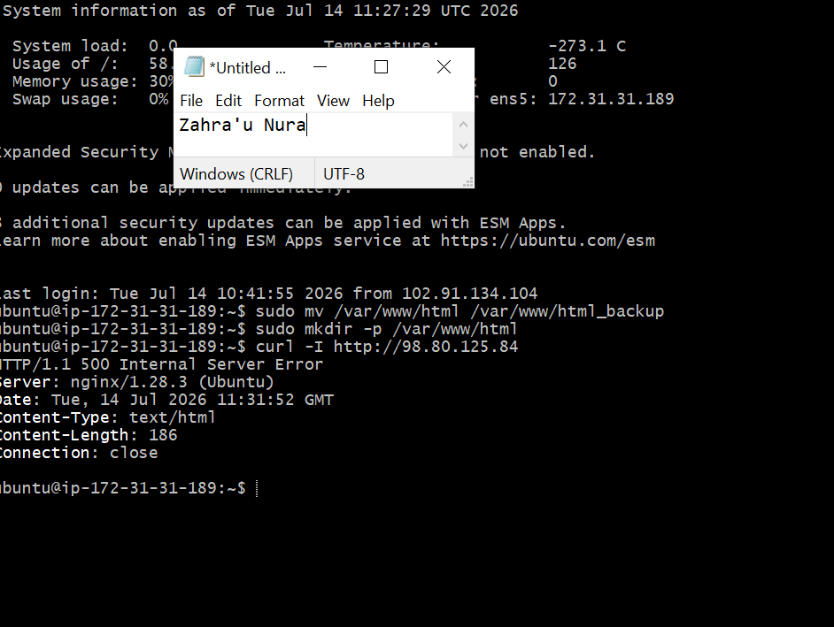

---

#### Screenshot 2 — Output of `curl -I http://<public-ip>` confirming recovery (200 OK)

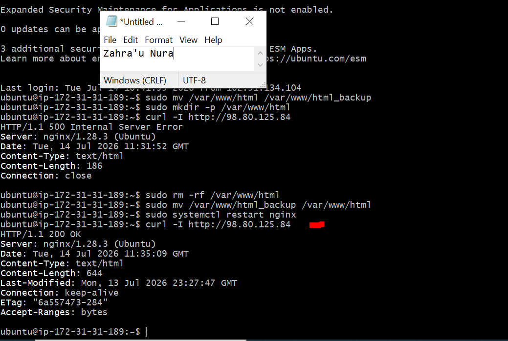

---

### Notes

Answer the following in your own words:

**1. What caused the application to break in this scenario?**

The application went down because the Nginx web root (/var/www/html), which serves the React application, was accidentally left empty after the deployment files were removed. Although the Nginx service was still running and its configuration remained correct, it had no application files to serve. As a result, users received a 500 Internal Server Error instead of the React application..

---

**2. How did you fix the issue and restore the application?**

Fortunately, a backup of the deployed application had been created before making any changes. Instead of permanently deleting the files, they had been moved to the html_backup directory. To restore the application, I removed the empty web root, moved the backup back to /var/www/html, and restarted Nginx to ensure it was serving the restored files correctly. I then verified the recovery using curl -I, which returned a 200 OK response. The response headers, including Content-Length, Last-Modified, and ETag, matched the original deployment, confirming that the correct version of the application had been successfully restored.

---

**3. What steps would you take to prevent this kind of issue in real production systems?**

To reduce the risk of similar incidents in production, I would implement several best practices. First, I would ensure that every deployment creates an automated backup so that a previous version can be restored quickly if needed. Instead of deploying directly to the live web root, I would deploy each release to a versioned directory and use a symbolic link (for example, /var/www/current) to switch between releases atomically. This approach prevents the live application directory from ever being left empty during deployment.
I would also add validation checks to the CI/CD pipeline to confirm that essential files, such as index.html, exist and are valid before considering a deployment successful. Finally, I would configure automated post-deployment health checks and monitoring to verify that the application is returning a healthy HTTP 200 response immediately after deployment, allowing any issues to be detected and resolved before they impact users.

---

# Task 8 — Security & Reliability Review

## Goal

Review and reflect on the security and reliability practices applied during this assignment.

### Security & Reliability Notes

Answer the following in your own words:

**1. Why is SSH key-based authentication more secure than sharing passwords?**

SSH key-based authentication uses a cryptographic key pair that is much harder to guess or brute-force than passwords. It also eliminates the need to share or transmit passwords..

---

**2. Why should only required ports be open on a production server?**

Keeping only necessary ports open reduces the server's attack surface and minimizes the risk of unauthorized access or exploitation.

---

**3. Why is it important for Nginx to be enabled on boot?**

Enabling Nginx on boot ensures the web server starts automatically after a reboot, keeping the application available without manual intervention.

---

**4. What are the risks of sharing secrets, keys, or credentials publicly?**

Exposing secrets or credentials can allow attackers to access systems, steal data, modify resources, or incur unexpected cloud costs.

---

**5. Why should cloud resources be stopped or terminated when they are no longer needed?**

Stopping or terminating unused resources helps reduce cloud costs, prevents unnecessary resource consumption, and lowers the security risk of idle services.

---

# LinkedIn Post (Required)

## Evidence

#### LinkedIn Post URL

Paste your LinkedIn post URL here:

`https://www.linkedin.com/posts/zahra-u-nura_dmi-cohort-4-live-micro-internship-waiting-share-7483184985923989504-7EB-/?utm_source=share&utm_medium=member_desktop&rcm=ACoAABhheJ4Bw5LI3hMBUfCD5MZiGRXdKYKjr0U`

---

#### Screenshot — Published LinkedIn post

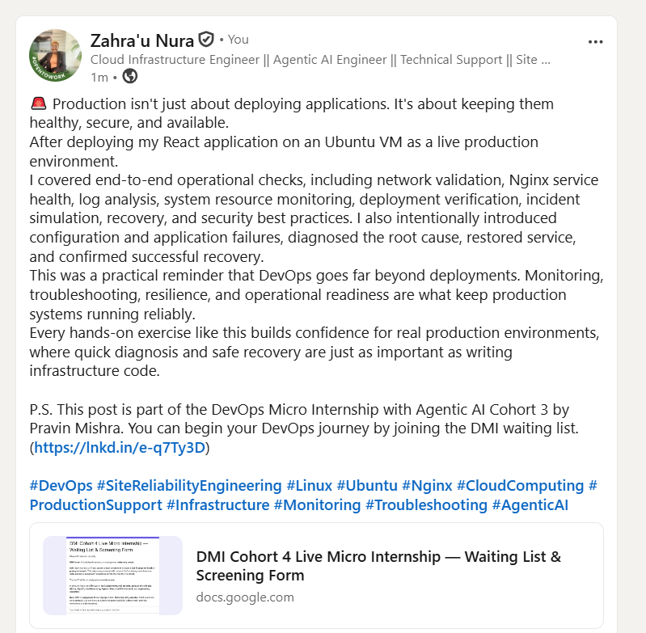

---

# Submission Instructions

- Add all required screenshots in your submission
- Full name must be visible in required screenshots
- Do not expose sensitive information (keys, passwords, account IDs)

---

# Completion Checklist

- [ ] Task 1: Screenshots (browser, ip a, ss -tulpen, ufw status) + Notes answered
- [ ] Task 2: Screenshots (nginx status, nginx -t, ss port 80) + Notes answered
- [ ] Task 3: Screenshots (access log, error log, journalctl) + Notes answered
- [ ] Task 4: Screenshots (uptime, free -h, df -h, du -sh) + Notes answered
- [ ] Task 5: Screenshots (ls html, grep deployed by, grep try_files) + Notes answered
- [ ] Task 6: Screenshots (nginx -t fail, nginx -t pass, curl recovery) + Notes answered
- [ ] Task 7: Screenshots (curl failure, curl recovery) + Notes answered
- [ ] Task 8: Security & Reliability Notes answered
- [ ] LinkedIn post published and URL submitted
- [ ] Full Name visible in all required screenshots
- [ ] No sensitive data exposed

---

## 📌 About DMI & CloudAdvisory

DevOps Micro Internship (DMI) is a project-based DevOps program run by Pravin Mishra (The CloudAdvisory) focused on real-world execution, systems thinking, and career readiness.

It helps learners build strong DevOps foundations with hands-on experience.

---

## 📌 Resources

- 🌐 DMI Official Website: https://pravinmishra.com/dmi  
- 🎓 DevOps for Beginners (Udemy): https://www.udemy.com/course/devops-for-beginners-docker-k8s-cloud-cicd-4-projects/  
- 🎓 Agentic AI DevOps with Claude Code: https://www.udemy.com/course/ultimate-agentic-ai-devops-with-claude-code/  
- 🎓 DevOps with Claude Code: Terraform, EKS, ArgoCD & Helm: https://www.udemy.com/course/devops-with-claude-code-terraform-eks-argocd-helm/  
- ▶️ YouTube Playlist: https://www.youtube.com/playlist?list=PLFeSNDtI4Cho  
- 🔗 Pravin Mishra (LinkedIn): https://www.linkedin.com/in/pravin-mishra-aws-trainer/  
- 🏢 CloudAdvisory (LinkedIn): https://www.linkedin.com/company/thecloudadvisory/

---

*This submission is part of DevOps Micro Internship (DMI) Cohort 3 — Agentic AI Track.*