# Assignment 5 — Bash Script Automation Drill (OPS Checklist)

Part of the DevOps Micro Internship (DMI) Cohort 3 with Agentic AI

---

## Purpose

In this assignment, you will practice Bash scripting by building a series of small automation scripts covering environment setup, variables, arrays, loops, file conditionals, if-else logic, and functions. These scripts form the foundation of real-world Linux automation used in DevOps, cloud, and production support environments.

---

# Task 1 — Bash Environment & Workspace Setup

## Goal

Verify that Bash is available on your system and create a clean workspace for this assignment.

### Evidence

#### Screenshot 1 — Output of `echo $SHELL` and `bash --version`

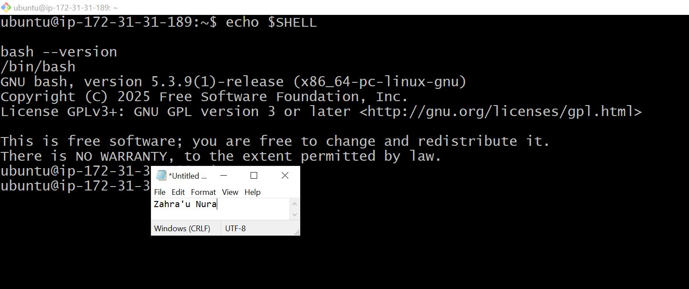

---

#### Screenshot 2 — Output of `pwd` and `ls -lah` showing the scripts directory

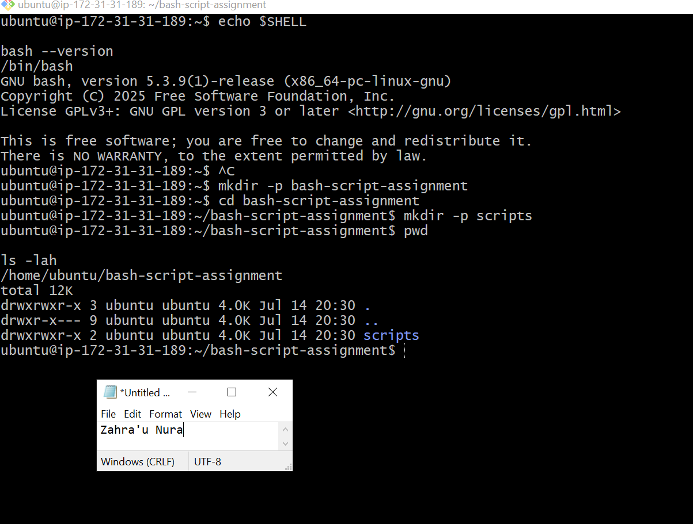

---

### Notes

Answer the following in your own words:

**1. What is Bash?**

Bash (Bourne Again SHell) is a command-line shell and scripting language used to interact with Linux systems, automate tasks, and execute commands.

---

**2. What is the difference between shell and Bash?**

A shell is a program that allows users to interact with the operating system. Bash is one of the most widely used shell implementations on Linux and Unix systems.

---

**3. Why is it important to confirm the Bash version before writing scripts?**

Different Bash versions support different features and syntax. Confirming the version helps ensure your scripts are compatible and run as expected on the target system.

---

# Task 2 — Your First Bash Script

## Goal

Create your first Bash script, make it executable, and run it from the terminal.

### Evidence

#### Screenshot 1 — Content of `first-script.sh`

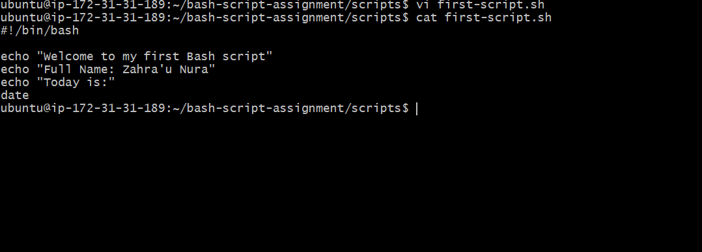.

---

#### Screenshot 2 — Output of `./first-script.sh`

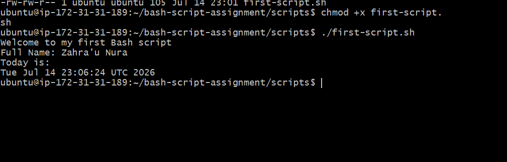

---

#### Screenshot 3 — Output of `ls -l first-script.sh` showing executable permission

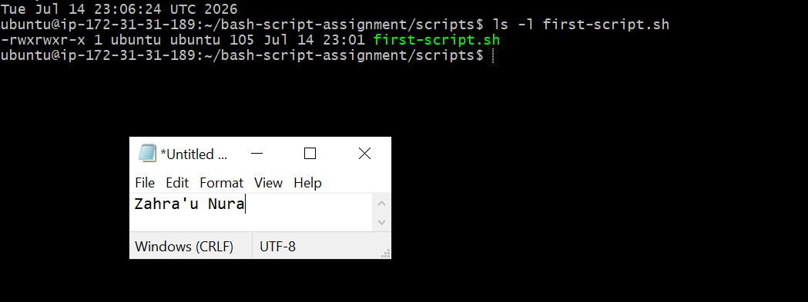

---

### Notes

Answer the following in your own words:

**1. What is the purpose of `#!/bin/bash`?**

The #!/bin/bash line, known as the shebang, tells the operating system to execute the script using the Bash shell. This ensures the script runs with the correct interpreter.

---

**2. Why do we use `chmod +x` before running a script?**

The chmod +x command makes a script executable by granting execute permission. Without it, the script cannot be run directly as a program.

---

**3. What is the difference between running a script using `./script.sh` and `bash script.sh`?**

./script.sh executes the script directly and requires the script to have execute permission and a valid shebang. bash script.sh explicitly runs the script using the Bash interpreter, so it does not require execute permission or a shebang.

---

# Task 3 — Variables: User Information Script

## Goal

Use variables to store and display user-related information.

### Evidence

#### Screenshot 1 — Content of `user-info.sh`

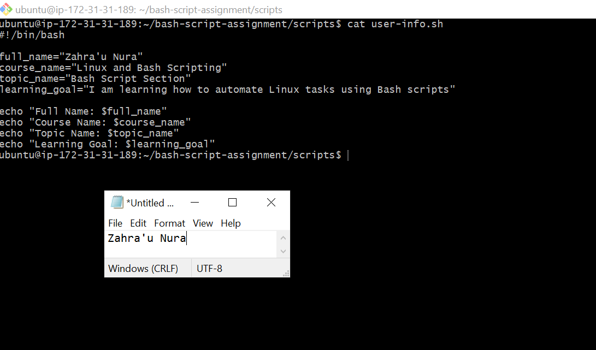

---

#### Screenshot 2 — Output of `./user-info.sh`

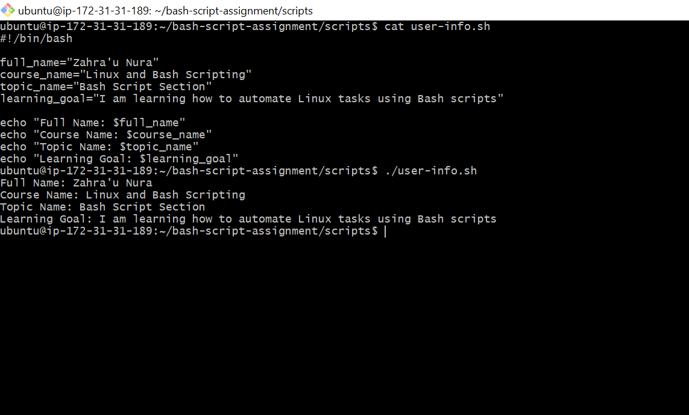

---

### Notes

Answer the following in your own words:

**1. What is a variable in Bash?**

A variable in Bash is a named container used to store data, such as text, numbers, or command output, that can be reused throughout a script.

---

**2. Why should we avoid spaces around the `=` sign when creating variables?**

Bash requires variable assignments to have no spaces around the = sign. Adding spaces causes Bash to interpret the statement as a command instead of a variable assignment.

---

**3. How do you access the value stored inside a Bash variable?**

You access the value of a Bash variable by prefixing its name with the $ symbol. For example, if the variable is NAME, you retrieve its value using $NAME.

---

# Task 4 — Arrays & Loops: Tools Checklist Script

## Goal

Use arrays and loops to print a checklist of tools used in Bash scripting.

### Evidence

#### Screenshot 1 — Content of `tools-checklist.sh`

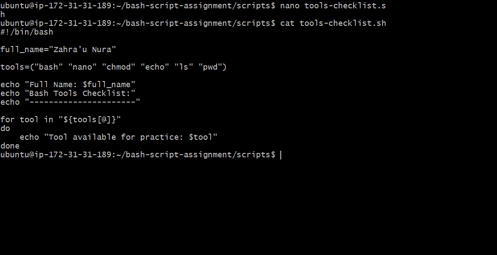

---

#### Screenshot 2 — Output of `./tools-checklist.sh`

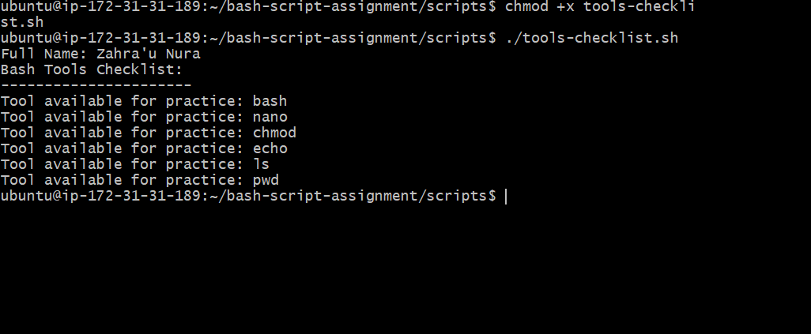

---

### Notes

Answer the following in your own words:

**1. What is an array in Bash?**

An array in Bash is a variable that stores multiple values under a single name. Each value is accessed using its index.

---

**2. Why are arrays useful in scripts?**

Arrays make it easy to manage and process multiple related values without creating separate variables. They also simplify tasks such as looping through lists of items.

---

**3. What does `"${tools[@]}"` mean?**

"${tools[@]}" refers to all the elements in the tools array. It allows a script to access each array element individually, making it ideal for use in loops.

---

**4. What is the purpose of the `for` loop in this script?**

The for loop iterates through each item in the tools array and performs the specified action in this case, displaying each tool as part of the checklist.

---

# Task 5 — Loops: Number Counter Script

## Goal

Use loops to repeat a task multiple times.

### Evidence

#### Screenshot 1 — Content of `counter.sh`

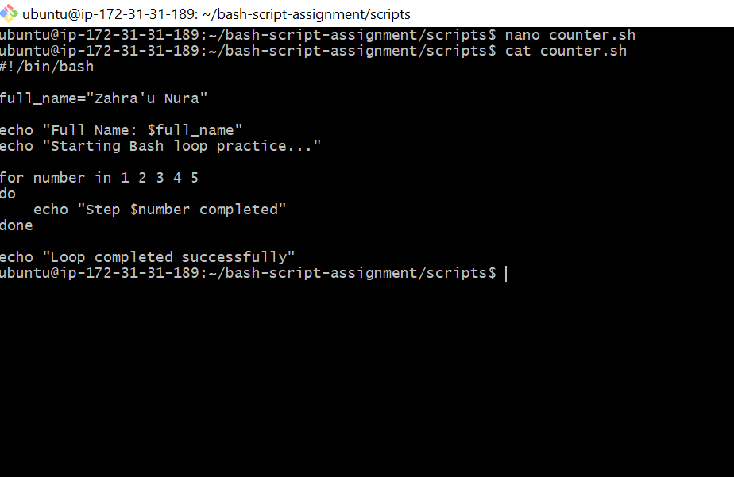

---

#### Screenshot 2 — Output of `./counter.sh`

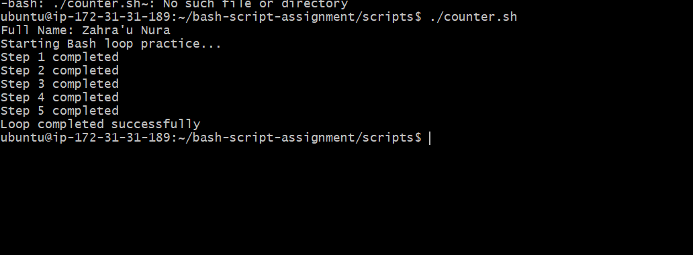

---

### Notes

Answer the following in your own words:

**1. What is a loop?**

A loop is a programming construct that repeatedly executes a block of code until a specified condition is met or all items in a collection have been processed.

---

**2. Why do we use loops in Bash scripting?**

Loops automate repetitive tasks, reduce duplicate code, and make scripts more efficient and easier to maintain.

---

**3. How many times did the loop run in your script?**

The loop ran 5 times.

---

**4. What would you change if you wanted the loop to run 10 times?**

I would use a numeric loop that iterates from 1 to 10.

---

# Task 6 — Files & Conditionals: File Validation Script

## Goal

Use file checks and conditionals to verify whether files and directories exist.

### Evidence

#### Screenshot 1 — Output of `ls -lah ../test-folder`

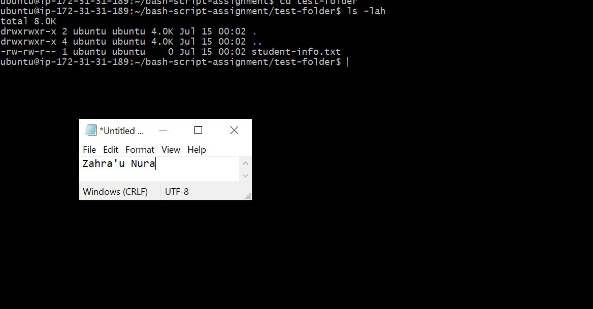.

---

#### Screenshot 2 — Content of `file-check.sh`

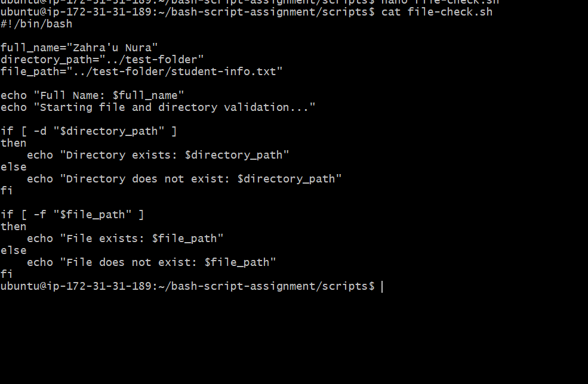.

---

#### Screenshot 3 — Output of `./file-check.sh`

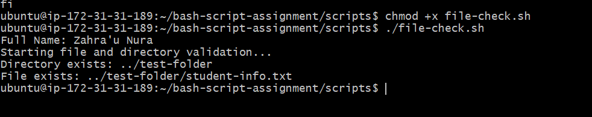

---

### Notes

Answer the following in your own words:

**1. What does `-d` check in Bash?**

The -d test checks whether a specified path exists and is a directory.

---

**2. What does `-f` check in Bash?**

The -f test checks whether a specified path exists and is a regular file.

---

**3. Why should file and directory paths be stored in variables?**

Storing paths in variables makes scripts easier to read, maintain, and update. If a path changes, it only needs to be modified in one place.

---

**4. What happens if the file does not exist?**

If the file does not exist, the -f test returns false, allowing the script to handle the situation, such as displaying an error message or taking an alternative action..

---

# Task 7 — Conditionals: Pass or Retry Script

## Goal

Use if-else conditionals to make decisions based on a variable value.

### Evidence

#### Screenshot 1 — Content of `score-check.sh` with `score=85`

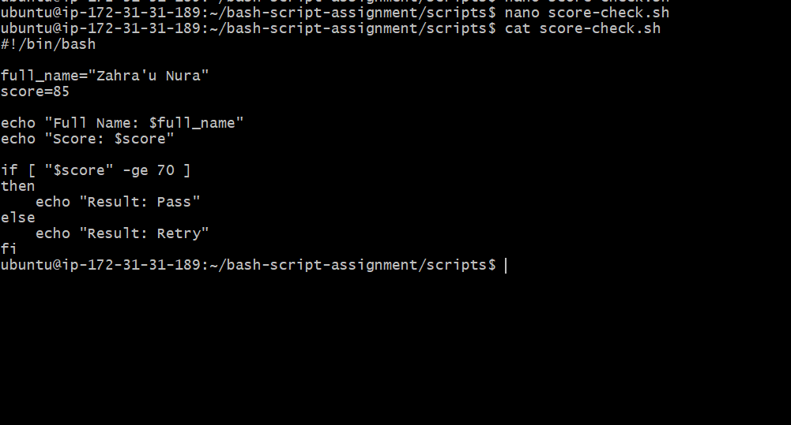

---

#### Screenshot 2 — Output showing `Result: Pass`

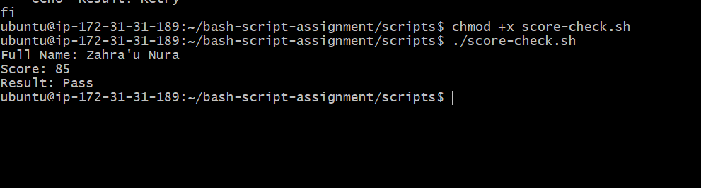

---

#### Screenshot 3 — Content of `score-check.sh` with `score=55`

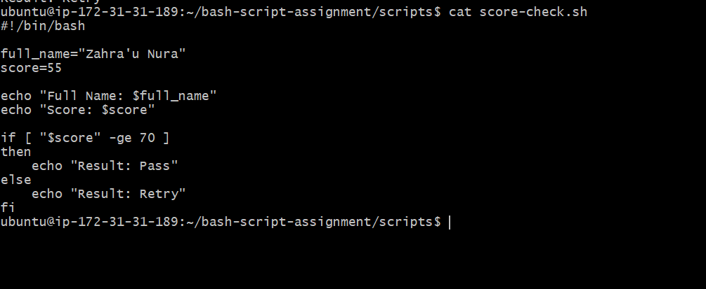

---

#### Screenshot 4 — Output showing `Result: Retry`

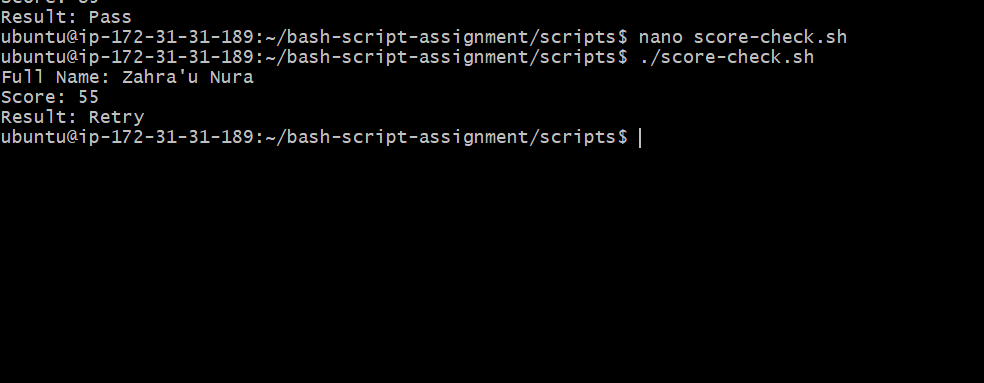

---

### Notes

Answer the following in your own words:

**1. What is the purpose of if-else in Bash?**

The if-else statement allows a script to make decisions by executing different blocks of code based on whether a condition is true or false.

---

**2. What does `-ge` mean?**

The -ge operator means greater than or equal to. It is used to compare two integer values in Bash.

---

**3. Why should conditions be tested with different values?**

Testing conditions with different values helps verify that the script behaves correctly in all scenarios and handles both expected and unexpected inputs.

---

**4. How can conditionals help in automation scripts?**

Conditionals enable automation scripts to make decisions based on system states or user input, allowing them to perform appropriate actions and handle errors automatically.

---

# Task 8 — Functions: Final Bash Automation Script

## Goal

Create a final Bash script using functions to organize reusable code.

### Evidence

#### Screenshot 1 — Content of `final-automation.sh`

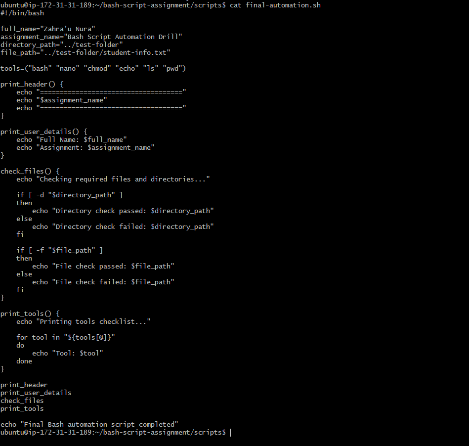

---

#### Screenshot 2 — Output of `./final-automation.sh`

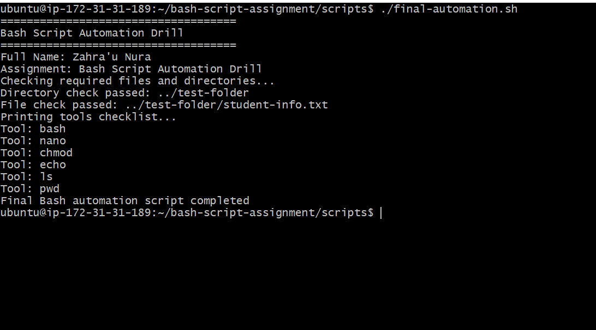

---

#### Screenshot 3 — Output of `ls -lah` showing all created scripts

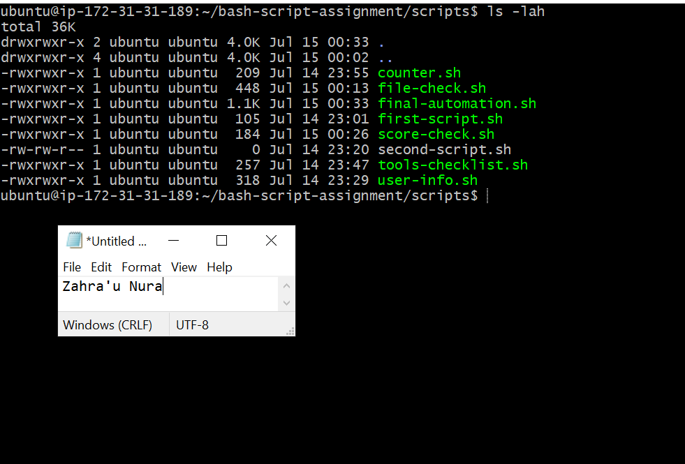

---

### Notes

Answer the following in your own words:

**1. What is a function in Bash?**

A function in Bash is a reusable block of code that performs a specific task. It can be called multiple times within a script, reducing repetition.

---

**2. Why are functions useful in scripts?**

Functions make scripts easier to read, maintain, and reuse by avoiding duplicate code. They also improve organization by separating different tasks into logical sections.

---

**3. Which functions did you create in this script?**

This script contains four functions:
- print_header() – Displays the script title.
- print_user_details() – Prints the user's name and assignment details.
- check_files() – Checks whether the required directory and file exist.
- print_tools() – Loops through the tools array and displays each tool.

---

**4. How does this final script combine variables, arrays, loops, conditionals, files, and functions?**

The script uses variables to store user and file information, an array to hold the list of tools, a for loop to display each tool, conditionals (if statements) to check whether the required file and directory exist, and functions to organize each task into reusable sections. Together, these features create a structured, maintainable, and automated Bash script.

---

# LinkedIn Post (Required)

## Evidence

#### LinkedIn Post URL

Paste your LinkedIn post URL here:

`https://lnkd.in/p/eFsWPFpE`

---

#### Screenshot — Published LinkedIn post

Add your screenshot here.

---

# Submission Instructions

- Add all required screenshots in your submission
- Full name must be visible in required screenshots
- All script files must be created and run successfully
- Required notes must be answered clearly for every task
- Do not expose sensitive information (keys, passwords, credentials)

---

# Completion Checklist

- [ ] Task 1: Environment setup verified, workspace created (Screenshots 1–2, Notes answered)
- [ ] Task 2: First script created, executed, permissions verified (Screenshots 1–3, Notes answered)
- [ ] Task 3: Variables script created and run (Screenshots 1–2, Notes answered)
- [ ] Task 4: Arrays and loops script created and run (Screenshots 1–2, Notes answered)
- [ ] Task 5: Counter loop script created and run (Screenshots 1–2, Notes answered)
- [ ] Task 6: File validation script created and run (Screenshots 1–3, Notes answered)
- [ ] Task 7: Pass/Retry conditional script tested with both values (Screenshots 1–4, Notes answered)
- [ ] Task 8: Final automation script created and run (Screenshots 1–3, Notes answered)
- [ ] All scripts run without errors
- [ ] Full Name visible in all required screenshots
- [ ] LinkedIn post published and URL submitted
- [ ] No sensitive data exposed

---

## 📌 About DMI & CloudAdvisory

DevOps Micro Internship (DMI) is a project-based DevOps program run by Pravin Mishra (The CloudAdvisory) focused on real-world execution, systems thinking, and career readiness.

It helps learners build strong DevOps foundations with hands-on experience.

---

## 📌 Resources

- 🌐 DMI Official Website: https://pravinmishra.com/dmi  
- 🎓 DevOps for Beginners (Udemy): https://www.udemy.com/course/devops-for-beginners-docker-k8s-cloud-cicd-4-projects/  
- 🎓 Agentic AI DevOps with Claude Code: https://www.udemy.com/course/ultimate-agentic-ai-devops-with-claude-code/  
- 🎓 DevOps with Claude Code: Terraform, EKS, ArgoCD & Helm: https://www.udemy.com/course/devops-with-claude-code-terraform-eks-argocd-helm/  
- ▶️ YouTube Playlist: https://www.youtube.com/playlist?list=PLFeSNDtI4Cho  
- 🔗 Pravin Mishra (LinkedIn): https://www.linkedin.com/in/pravin-mishra-aws-trainer/  
- 🏢 CloudAdvisory (LinkedIn): https://www.linkedin.com/company/thecloudadvisory/

---

*This submission is part of DevOps Micro Internship (DMI) Cohort 3 — Agentic AI Track.*