# Assignment 6 — Build an AI-Assisted Linux Health Check (AI-Assisted Linux Incident Triage)

Part of the DevOps Micro Internship (DMI) Cohort 3 with Agentic AI

---

## Purpose

In this assignment, you will build a read-only Bash triage script that checks the health of your Ubuntu server and Nginx application, connect it to Claude Code as a reusable `/linux-triage` skill, simulate a controlled Nginx incident, use the skill to gather and analyze evidence, recover the service manually, and verify recovery. The workflow follows the Agentic Loop: Gather → Analyze → Human Act → Verify.

---

# Task 1 — Confirm the Healthy Baseline and Create the Workspace

## Goal

Confirm that Nginx and the React application are healthy before building the automation.

### Evidence

#### Screenshot 1 — Output of `systemctl is-active nginx`, `ss -ltn | grep ':80'`, and `curl -I http://localhost`

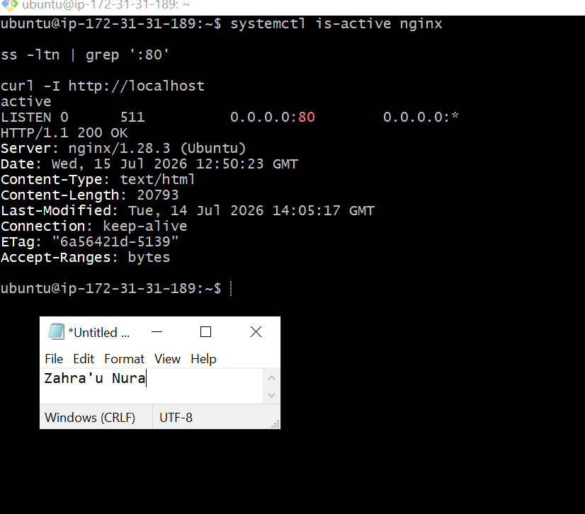

---

#### Screenshot 2 — Output of `pwd` and `find . -maxdepth 4 -type d | sort` showing the workspace folder structure

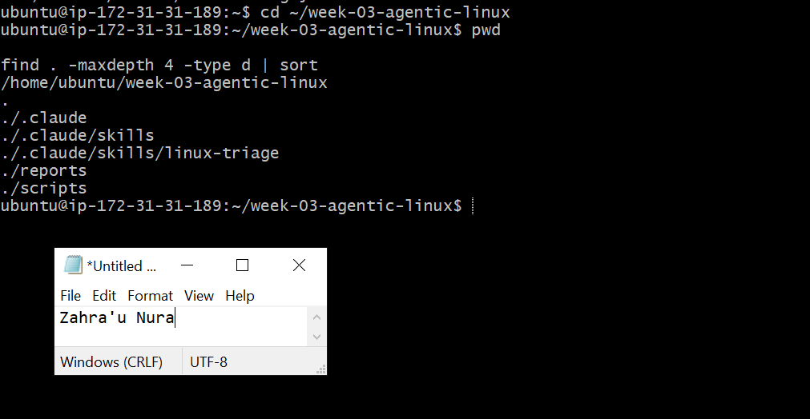

---

### Notes

Answer the following in your own words:

**1. What proves that Nginx is running?**

Nginx is confirmed to be running when the systemctl status nginx command shows the service is active (running).

---

**2. What proves that the server is listening for HTTP traffic?**

The server is listening for HTTP traffic when port 80 is shown as listening using commands such as ss -tuln or netstat, and the application responds successfully to an HTTP request.

---

**3. Why must you capture a healthy baseline before simulating an incident?**

A healthy baseline provides a known good state for comparison. It makes it easier to identify the root cause of an issue, verify the impact of the incident, and confirm that the system has been fully restored after recovery.

---

# Task 2 — Create Project Context and Safety Rules in CLAUDE.md

## Goal

Tell Claude exactly what this project does and what it is not allowed to do.

### Evidence

#### Screenshot 3 — CLAUDE.md open in VS Code showing all four sections (Project Overview, Incident Workflow, Safety Rules, Output Rules)

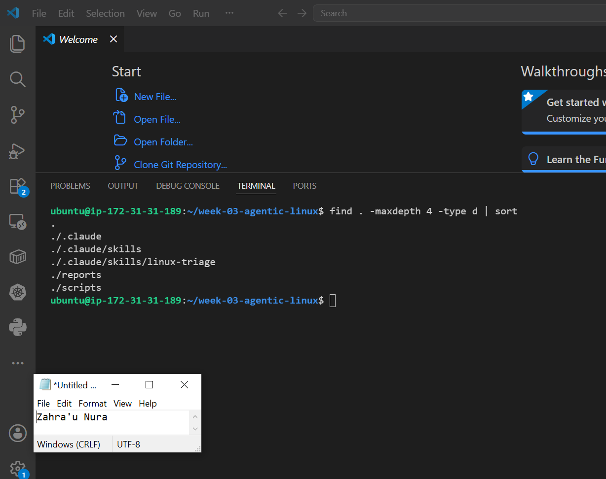

---

### Notes

Answer the following in your own words:

**1. Why should Claude receive project-specific operational rules?**

Project-specific operational rules help Claude provide responses that align with the project's standards, workflows, and constraints, resulting in more accurate and consistent assistance.

---

**2. Why is the human required to execute the recovery command?**

Recovery commands can directly affect production systems. Requiring a human to execute them ensures critical actions are reviewed, approved, and carried out responsibly.

---

**3. Which rule prevents Claude from making an unsupported diagnosis?**

The rule that requires Claude to base its conclusions on available evidence and logs, rather than assumptions, prevents it from making an unsupported diagnosis.

---

# Task 3 — Use Agentic AI to Plan Before Writing the Script

## Goal

Use Claude Code to inspect the environment and produce a read-only plan before creating any Bash code.

### Evidence

#### Screenshot 4 — Claude Code showing the five-check plan and read-only inspection results

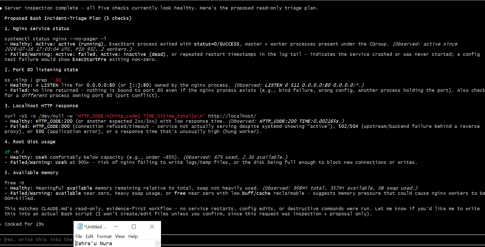

---

### Notes

Answer the following in your own words:

**1. Which part of this task represents the Gather phase?**

The Gather phase is where Claude collects and reviews relevant information about the project, such as existing files, configurations, and requirements, before proposing a solution.

---

**2. Did Claude follow the instruction not to create files? How did you verify this?**

Yes. Claude only analyzed the project and provided recommendations without creating any new files. I verified this by checking the project directory and confirming that no additional files had been added.

---

**3. Why is planning before coding useful in DevOps automation?**

Planning helps identify requirements, dependencies, and potential risks before implementation. This reduces errors, improves efficiency, and ensures automation is built correctly the first time.

---

# Task 4 — Build the Linux Triage Bash Script

## Goal

Create one Bash script that gathers consistent Linux and Nginx health evidence.

### Evidence

#### Screenshot 5 — Top section of `linux-triage.sh` showing variables, thresholds, and the checks array

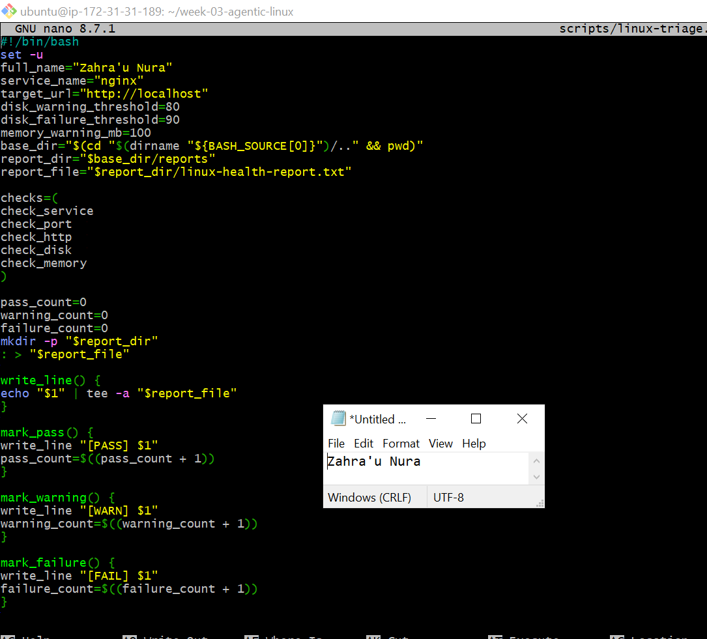

---

#### Screenshot 6 — Middle section showing check functions and conditionals

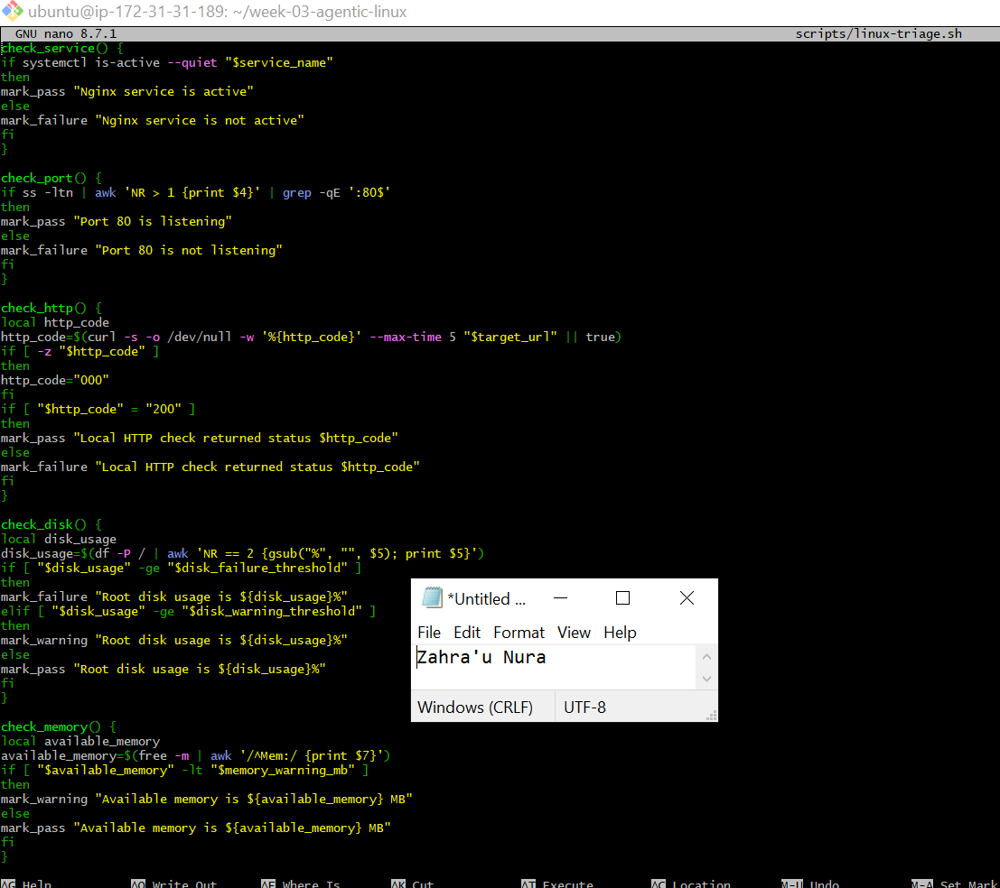

---

#### Screenshot 7 — Bottom section showing the loop, summary function, and exit behavior

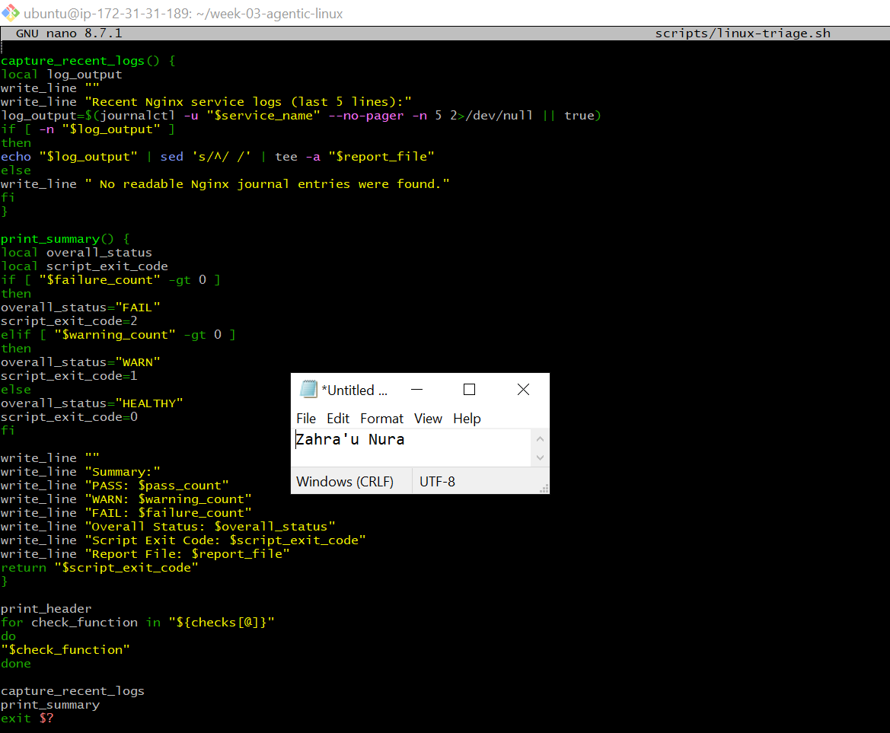

---

#### Screenshot 8 — Output of `bash -n scripts/linux-triage.sh` (no syntax errors) and `ls -l scripts/linux-triage.sh` showing executable permission

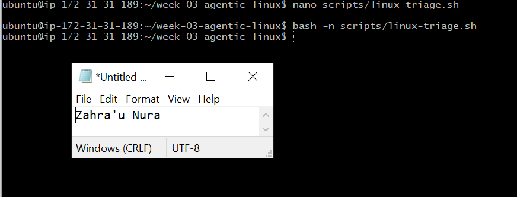

---

### Notes

Answer the following in your own words:

**1. What is stored in the checks array?**

The checks array stores the list of health check functions or tasks that the script needs to execute to verify the system's health.

---

**2. How does the `for` loop use that array?**

The for loop iterates through each item in the checks array and executes each health check one at a time.

---

**3. Why are the health checks separated into functions?**

Separating health checks into functions improves code organization, makes the script easier to maintain, and allows each check to be reused independently.

---

**4. What is the purpose of `$(...)` in this script?**

$(...) performs command substitution, allowing the output of a command to be captured and used as a value within the script.

---

**5. Why does the script use different exit codes for HEALTHY, WARN, and FAIL?**

Different exit codes allow the script to clearly communicate the result of the health check. They enable users and automation tools to distinguish between successful, warning, and failure states and take appropriate actions.

---

# Task 5 — Run and Understand the Healthy-State Report

## Goal

Run the Bash script against the healthy server and verify that it creates a report.

### Evidence

#### Screenshot 9 — Output of `./scripts/linux-triage.sh` showing your Full Name and all five check results

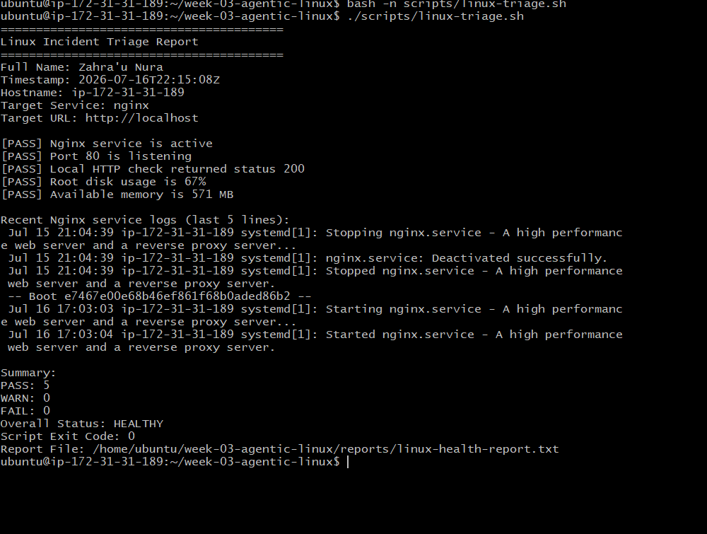

---

#### Screenshot 10 — Output showing the captured exit code and final summary

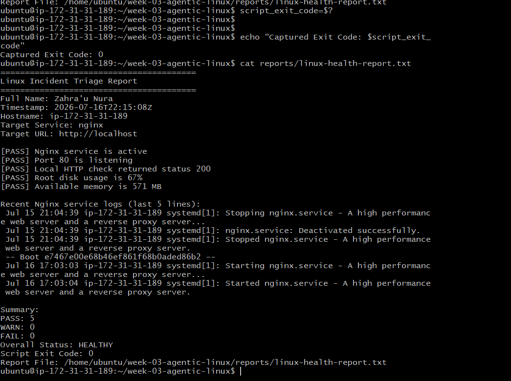

---

### Notes

Answer the following in your own words:

**1. What is the overall status of your healthy baseline?**

The healthy baseline indicates that the system is operating normally. All required services are running, the application is accessible, and no critical issues were detected.

---

**2. Which exact Linux evidence proves the application is serving traffic?**

The successful HTTP 200 OK response from curl confirms the application is serving traffic. Additionally, Nginx was running, and the server was listening on port 80.

---

**3. Did your script return exit code 0 or 1? Explain why.**

The script returned exit code 0 because all health checks passed successfully, indicating the system was in a healthy state.

---

**4. What is the difference between a warning and a failure in this script?**

A warning indicates a non-critical issue that should be monitored but does not stop the application from functioning. A failure indicates a critical problem that affects the application's health or availability and requires immediate action.

---

# Task 6 — Create and Run the /linux-triage Skill

## Goal

Turn the Bash script into a reusable, manually invoked Agentic AI workflow.

### Evidence

#### Screenshot 11 — `SKILL.md` showing the frontmatter, allowed tool restrictions, and safety rules

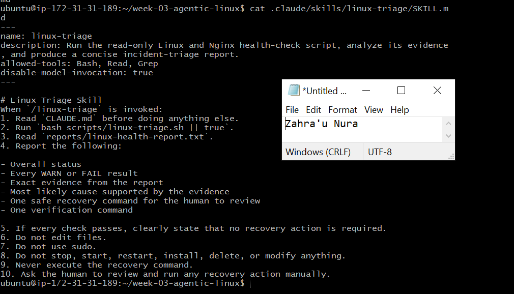.

---

#### Screenshot 12 — `/linux-triage` output for the healthy server

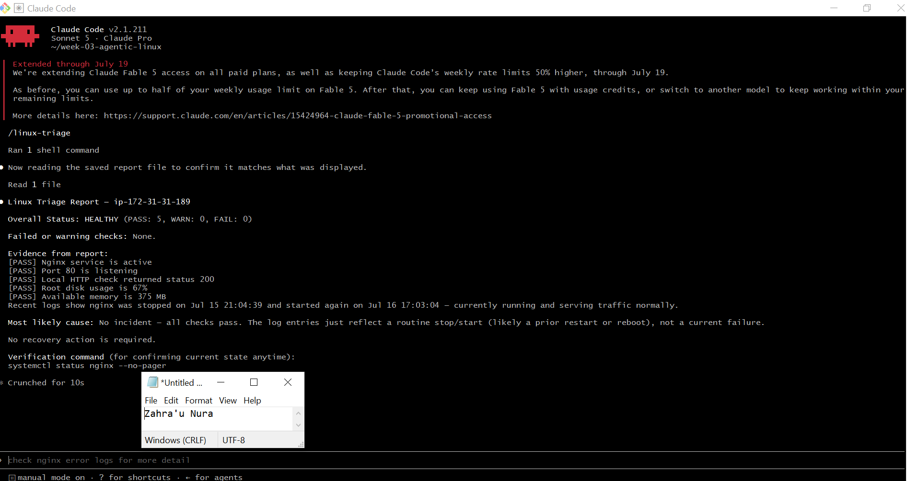

---

### Notes

Answer the following in your own words:

**1. Why does this skill have Bash, Read, and Grep, but not Write?**

The skill only needs to collect and analyze system information, so it requires Bash, Read, and Grep permissions. Excluding Write ensures it cannot modify files or system configurations, reducing the risk of accidental changes.

---

**2. Why is `disable-model-invocation: true` useful for this skill?**

Setting disable-model-invocation: true ensures the skill only executes its predefined commands and does not invoke the language model. This provides predictable, consistent results and improves security for operational tasks.

---

**3. What part is performed by Bash, and what part is performed by Claude?**

Bash collects the server data by running commands such as checking services, logs, and system status. Claude interprets the collected output, summarizes the findings, and explains the overall health of the system.

---

**4. Why is this better than asking Claude "Is my server healthy?" without giving it evidence?**

Providing real system data allows Claude to make an evidence-based assessment instead of relying on assumptions. This leads to more accurate, reliable, and actionable results.

---

# Task 7 — Simulate an Nginx Incident and Let the Skill Diagnose It

## Goal

Create a controlled service failure, gather evidence through Bash, and let Claude analyze the evidence without taking recovery action.

### Evidence

#### Screenshot 13 — Output showing Nginx is inactive and the HTTP request fails

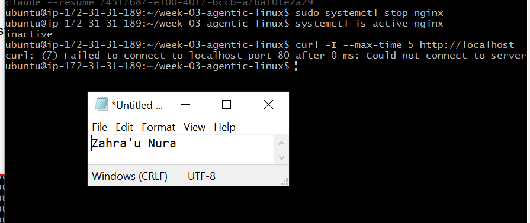

---

#### Screenshot 14 — `/linux-triage` output showing failed evidence, most likely cause, and a suggested recovery command

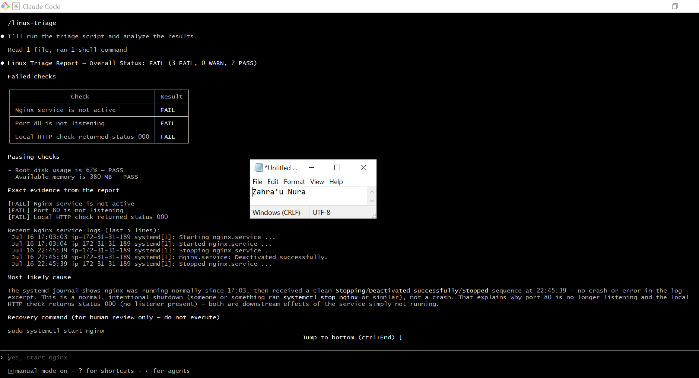

---

#### Screenshot 15 — `incident-failure-report.txt` showing the failed checks and your Full Name

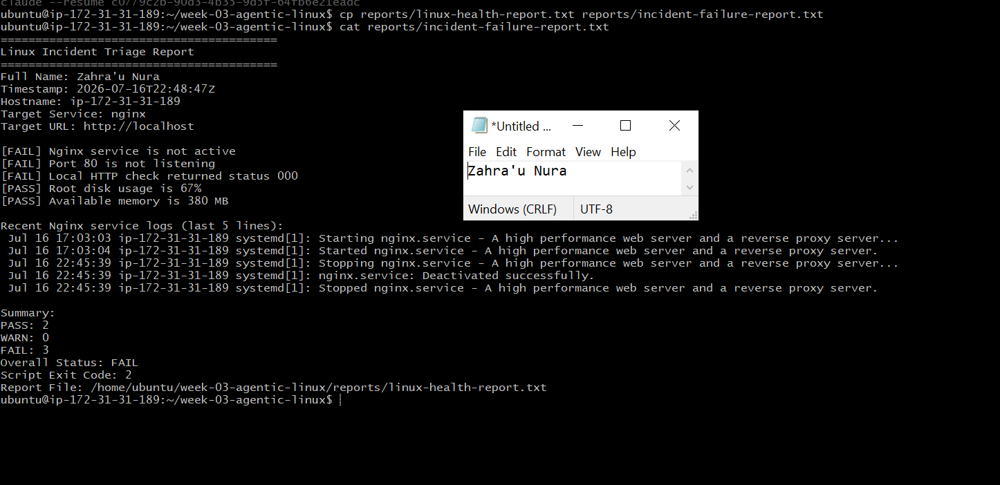

---

### Notes

Answer the following in your own words:

**1. Which three checks failed?**

The Nginx service check, port 80 listening check, and local HTTP request check failed. The disk and memory checks remained healthy because they were not affected by the Nginx service being stopped.

---

**2. What evidence supports the conclusion that Nginx is unavailable?**

The health report showed that the Nginx service was inactive, port 80 was not listening, and the local HTTP request returned a 000 status code. These results confirm that Nginx was unavailable and unable to serve the application.

---

**3. Did Claude execute the recovery command? Why is that important?**

No. Claude only suggested the recovery command and did not execute it. This is important because recovery actions should always be reviewed and approved by a human to prevent unintended changes to the server.

---

**4. Which phase of the Agentic Loop is represented by the Bash report?**

The Bash report represents the Gather phase, where system information such as service status, port availability, HTTP response, disk usage, memory usage, and logs is collected for analysis.

---

**5. Which phase is represented by Claude's explanation?**

Claude's explanation represents the Analyze phase. It reviews the collected evidence, identifies the failed checks, explains the likely root cause, and recommends the appropriate recovery action.

---

# Task 8 — Recover Manually, Verify Again, and Write the Incident Summary

## Goal

Recover the service as the human operator and prove that the system is healthy again.

### Evidence

#### Screenshot 16 — Output showing Nginx is active and `curl -I http://localhost` returns 200 OK

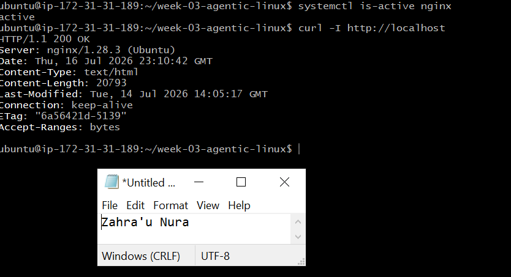

---

#### Screenshot 17 — Second `/linux-triage` output showing successful recovery with no FAIL results

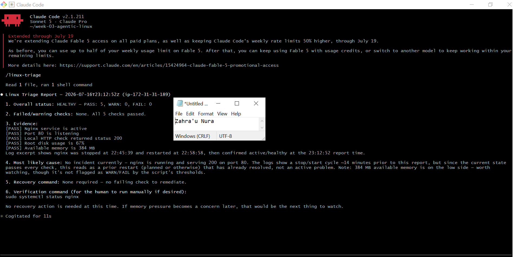

---

#### Screenshot 18 — Output of `ls -lah reports` showing both `incident-failure-report.txt` and `recovery-report.txt`

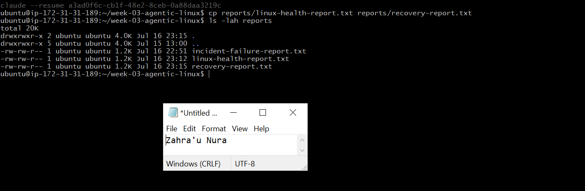

---

#### Screenshot 19 — `incident-summary.md` showing all required sections and your Full Name

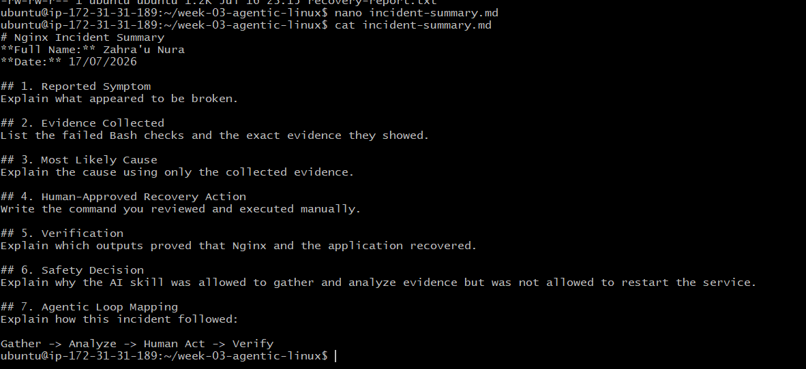

---

### Notes

Answer the following in your own words:

**1. What action did you execute manually?**

After reviewing the health check results and Claude's recommendation, I manually executed: sudo systemctl start nginx

This restarted the Nginx service and brought the web server back online.

---

**2. What evidence proves that the service recovered?**

I confirmed the recovery by checking that systemctl is-active nginx returned active. I also verified that the application responded with HTTP/1.1 200 OK, and the second /linux-triage report showed that all health checks passed successfully.

---

**3. Why is the second triage run necessary?**

Restarting the service alone doesn't guarantee that the application is fully operational. Running the triage a second time verifies that Nginx, the HTTP endpoint, disk usage, memory, and other health checks have all returned to a healthy state.

---

**4. What could go wrong if an AI agent automatically restarted every failed service?**

Automatically restarting services without understanding the root cause could hide underlying issues, trigger repeated failures, or make an incident worse. It's important to review the evidence first so the appropriate recovery action can be taken.

---

**5. In one sentence, explain the difference between using AI as a chatbot and using AI in this agentic workflow.**

A chatbot simply responds to questions, while in this agentic workflow, Claude analyzes real system data, provides evidence-based recommendations, and leaves critical recovery actions for me to review and execute.

---

# Incident Summary

Fill in all seven sections below in your own words.

**Full Name:** Zahra'u Nura

**Date:** 17/07/2026

---

**1. Reported Symptom**

The web application became unavailable after the Nginx service stopped. Users were unable to access the application over HTTP.

---

**2. Evidence Collected**

The health check showed that the Nginx service was inactive, port 80 was not listening, and the local HTTP request returned a 000 status code. Disk and memory checks remained healthy.

---

**3. Most Likely Cause**

The most likely cause was that the Nginx service was stopped, preventing the server from accepting and serving HTTP requests.

---

**4. Human-Approved Recovery Action**

After reviewing the evidence and Claude's recommendation, I manually restarted the Nginx service using:sudo systemctl start nginx.

---

**5. Verification**

I confirmed the recovery by verifying that the Nginx service was active, the application returned an HTTP 200 OK response, and the second health check showed all services were operating normally.

---

**6. Safety Decision**

The recovery action was performed manually after reviewing the collected evidence. Claude provided guidance, but the final decision and execution remained under my control to ensure safe system changes.

---

**7. Agentic Loop Mapping**

Gather: The Bash health check collected system status, service information, HTTP response, and resource usage.
Analyze: Claude reviewed the collected evidence, identified the root cause, and recommended the appropriate recovery action.
Act: I manually restarted the Nginx service.
Verify: A second health check confirmed that the application and all services had returned to a healthy state.

---

# LinkedIn Post (Required)

## Evidence

#### LinkedIn Post URL

Paste your LinkedIn post URL here:

`https://www.linkedin.com/posts/zahra-u-nura_devops-sitereliabilityengineering-linux-share-7483672980397518848-lEDs/?utm_source=share&utm_medium=member_desktop&rcm=ACoAABhheJ4Bw5LI3hMBUfCD5MZiGRXdKYKjr0U`

---

#### Screenshot — Published LinkedIn post

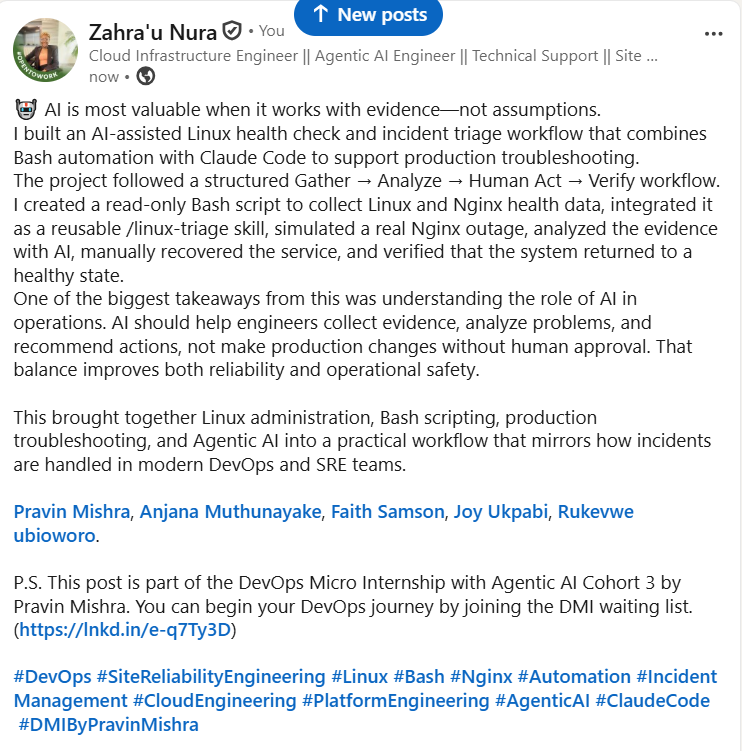

---

# GitHub Repository URL

Paste the URL of your GitHub folder or repository containing the assignment files here:

`https://github.com/lalanur/devops-micro-internship-pravinmishra.git`

---

# Submission Instructions

- Add all required screenshots in your submission
- Full Name must be visible in required screenshots and the Bash report
- All written answers must be in your own words
- Do not expose sensitive information (keys, passwords, AWS account IDs, tokens)
- GitHub URL must be included in this document

---

# Completion Checklist

- [ ] Task 1: Healthy baseline confirmed, workspace created (Screenshots 1–2, Notes answered)
- [ ] Task 2: CLAUDE.md created with all four sections (Screenshot 3, Notes answered)
- [ ] Task 3: Five-check plan produced by Claude using read-only tools (Screenshot 4, Notes answered)
- [ ] Task 4: `linux-triage.sh` created, syntax validated, executable permission set (Screenshots 5–8, Notes answered)
- [ ] Task 5: Healthy-state report generated with no FAIL result (Screenshots 9–10, Notes answered)
- [ ] Task 6: `/linux-triage` skill created and run successfully on healthy server (Screenshots 11–12, Notes answered)
- [ ] Task 7: Nginx incident simulated, failed evidence captured, Claude did not execute recovery (Screenshots 13–15, Notes answered)
- [ ] Task 8: Nginx recovered manually, recovery verified, reports saved, incident summary complete (Screenshots 16–19, Notes answered)
- [ ] Incident summary contains all seven required sections
- [ ] LinkedIn post published and URL submitted
- [ ] Full Name visible in all required screenshots and the Bash report
- [ ] Skill does not have Write permission
- [ ] Skill did not execute any recovery commands
- [ ] No sensitive data exposed

---

## 📌 About DMI & CloudAdvisory

DevOps Micro Internship (DMI) is a project-based DevOps program run by Pravin Mishra (The CloudAdvisory) focused on real-world execution, systems thinking, and career readiness.

It helps learners build strong DevOps foundations with hands-on experience.

---

## 📌 Resources

- 🌐 DMI Official Website: https://pravinmishra.com/dmi  
- 🎓 DevOps for Beginners (Udemy): https://www.udemy.com/course/devops-for-beginners-docker-k8s-cloud-cicd-4-projects/  
- 🎓 Agentic AI DevOps with Claude Code: https://www.udemy.com/course/ultimate-agentic-ai-devops-with-claude-code/  
- 🎓 DevOps with Claude Code: Terraform, EKS, ArgoCD & Helm: https://www.udemy.com/course/devops-with-claude-code-terraform-eks-argocd-helm/  
- ▶️ YouTube Playlist: https://www.youtube.com/playlist?list=PLFeSNDtI4Cho  
- 🔗 Pravin Mishra (LinkedIn): https://www.linkedin.com/in/pravin-mishra-aws-trainer/  
- 🏢 CloudAdvisory (LinkedIn): https://www.linkedin.com/company/thecloudadvisory/

---

*This submission is part of DevOps Micro Internship (DMI) Cohort 3 — Agentic AI Track.*