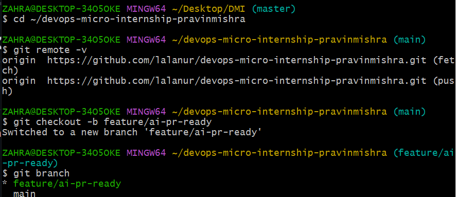
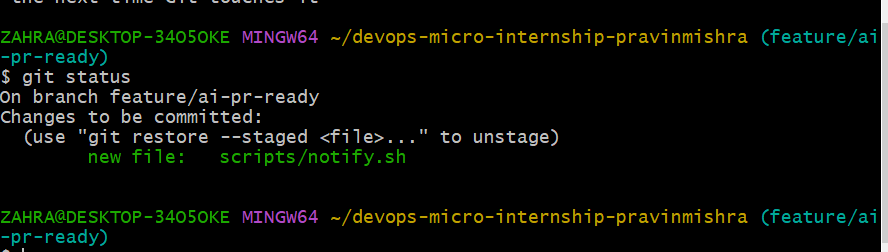
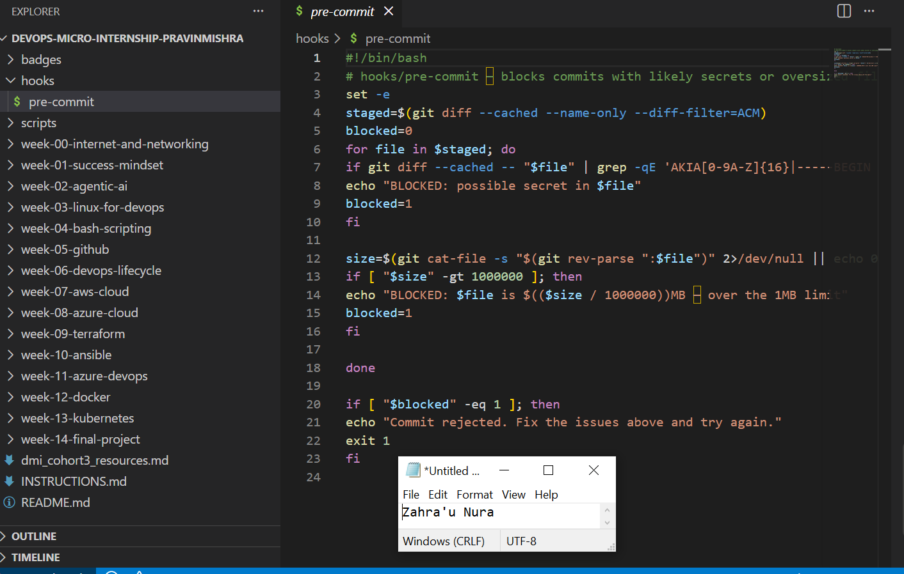
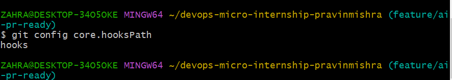
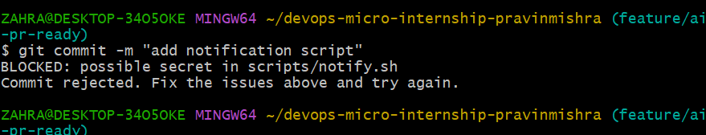
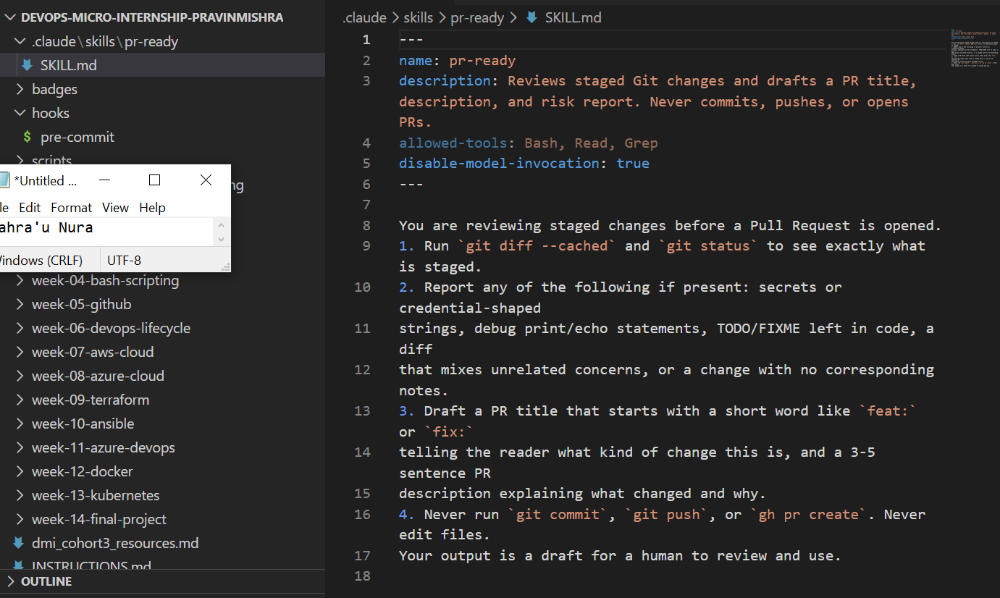
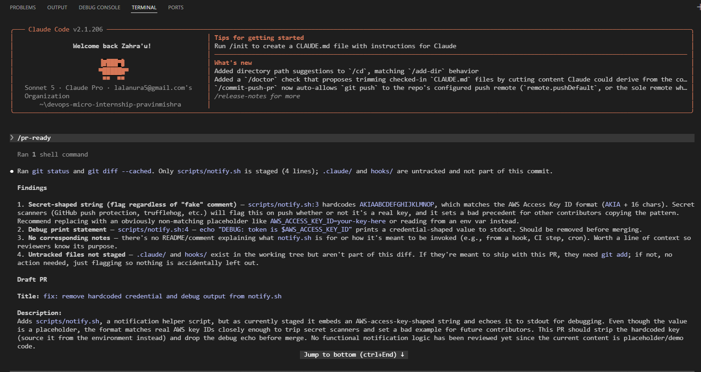
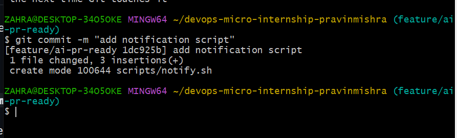
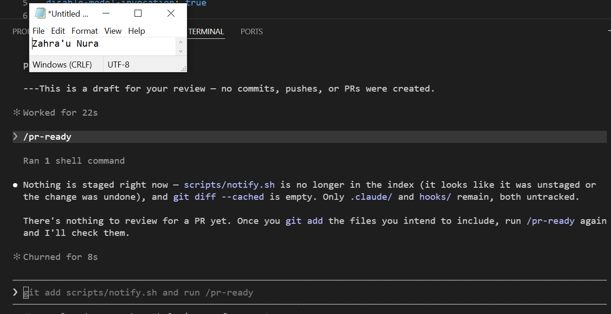
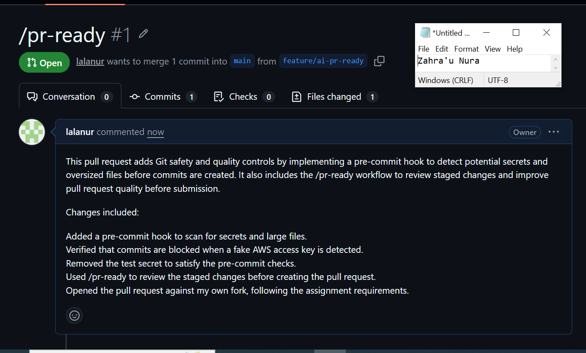

# Assignment 6 — Building an AI-Assisted Git Safety Net (PR Ready Check)

Part of the DevOps Micro Internship (DMI) Cohort 3 with Agentic AI

---

## Purpose

In Week 2 you built Claude Code hooks that block a dangerous action *before* it happens (`PreToolUse`), and a restricted skill that could look but not touch (`allowed-tools` without `Write`). In this assignment you will discover that Git has the exact same idea, decades older: a **pre-commit hook** that blocks a commit before it's created.

You will build both halves of a real "PR Ready" workflow:

1. A **Git hook that follows fixed rules** — scans staged changes for hardcoded secrets and oversized files and refuses the commit. No AI involved, no guessing, just a rule that gives the same answer every time.
2. A **restricted Claude Code skill** (`/pr-ready`) that reads your staged diff and drafts a Pull Request title, description, and a short list of things worth a second look — the kind of judgment a fixed rule can't make (mixed changes, missing context, unclear intent). The skill never commits, pushes, or opens the PR. You do that yourself, using its draft as a starting point.

This mirrors the Agentic Loop from Week 3's Linux triage assignment: **Gather → Analyze → Human Act → Verify**. The hook and the skill both gather and analyze; only you act.

---

# Task 0 — Confirm Your Fork and Create a Feature Branch

## Goal

Confirm you are working in your own fork, then create a dedicated branch for this assignment.

### Evidence

#### Screenshot 1 — Output of git remote -v and git branch showing the new branch

---

### Notes

**1. Why create a dedicated branch instead of doing this work on main?**

Creating a dedicated branch allows changes to be developed, tested, and reviewed without affecting the stable main branch. It reduces the risk of introducing errors into the production code and makes collaboration, code reviews, and merging changes much safer and more organized.

---

# Task 1 — Stage a Change With Realistic Risk

## Goal

On your own fork of this repository (the one you've been submitting your DMI work in since onboarding), create a new branch and stage a change that a real reviewer should catch: a hardcoded-looking secret and a leftover debug statement.

### Evidence

#### Screenshot 1 — Output of  `git status` showing the staged file on feature/ai-pr-ready

---

### Notes

**1. Why does this assignment use an obviously fake key instead of a real one?**

The assignment uses a fake key to demonstrate secure credential handling without exposing sensitive information. This allows us to practice safely while reinforcing the importance of never storing or sharing real secrets in code repositories or training materials.

---

# Task 2 — Write a Real Git Pre-Commit Hook

## Goal

Create a tracked, shareable pre-commit hook that blocks a commit containing secret-like patterns or files over 1MB.

### Evidence

#### Screenshot 2 — `hooks/pre-commit` open in VS Code showing the full script

---

#### Screenshot 3 — Output of `git config core.hooksPath` confirming it points to `hooks`

---

### Notes

**1. Why is `hooks/pre-commit` tracked in the repo instead of living only in `.git/hooks/`?**

Tracking hooks/pre-commit in the repository allows the hook to be version-controlled and shared with the entire team. Unlike .git/hooks/, which is local to each developer and not committed to Git, a tracked hook ensures everyone uses the same pre-commit checks, improving consistency and collaboration.

---

**2. Compare this to `PreToolUse` from Week 2 Assignment 6. What does each one intercept, and what do they have in common?**

The PreToolUse hook intercepts Bash commands before Claude executes them, allowing unsafe commands such as terraform destroy to be blocked before they run. The pre-commit hook intercepts Git commits before they are recorded, preventing commits that do not meet the project's requirements. Both act as preventive controls that enforce safety and quality checks before an action is completed, helping to reduce errors and protect the project.

---

# Task 3 — Prove the Hook Blocks the Risky Commit

## Goal

Attempt to commit the staged file from Task 1 and show the hook rejecting it.

### Evidence

#### Screenshot 4 — Terminal showing `git commit` rejected with the hook's "BLOCKED" message naming the exact file

---

### Notes

**1. Which line in `hooks/pre-commit` matched your fake key, and why did it match?**

The line below matched the fake AWS access key:
grep -qE 'AKIA[0-9A-Z]{16}|-----BEGIN (RSA|OPENSSH|PRIVATE) KEY-----'
It matched because the fake key started with the AKIA prefix followed by 16 uppercase letters or numbers, which fits the regular expression used to detect AWS Access Key IDs. This allowed the pre-commit hook to identify it as a potential secret and block the commit before it was added to the repository..

---

**2. Could this hook have caught a poorly-named variable that stores a secret without the `AKIA` prefix? What does that tell you about the limits of a fixed rule like this?**

No. The hook only detects patterns defined in its regular expression, such as AWS keys beginning with AKIA or private key headers. If a secret does not match those patterns, it may not be detected.

---

# Task 4 — Build the `/pr-ready` Skill

## Goal

Create a manually invoked Claude Code skill that reads your staged changes and produces a PR-readiness report and a draft PR description — without writing, committing, or pushing anything itself.

### Evidence

#### Screenshot 5 — `SKILL.md` frontmatter showing `allowed-tools: Bash, Read, Grep` (no `Write`) and `disable-model-invocation: true`

---

#### Screenshot 6 — `/pr-ready` output while the risky file is still staged, showing it flagged the secret and/or debug statement

---

### Notes

**1. Why does `/pr-ready` have `Bash` and `Read` but not `Write`?**

/pr-ready only needs to inspect the repository, run validation commands, and review the current state before a pull request. It does not need Write permission because its purpose is to assess readiness, not modify files. This keeps the process safer by preventing unintended changes to the codebase

---

**2. The pre-commit hook and `/pr-ready` both looked at the same staged diff. Did they flag the same things? What did one catch that the other didn't?**

They both reviewed the staged changes, but they focused on different types of issues. The pre-commit hook detected rule-based problems, such as potential secrets and oversized files, and blocked the commit if they were found. /pr-ready performed a broader review by checking the overall quality and readiness of the changes, identifying issues that go beyond simple pattern matching. Together, they provide both automated safety checks and a more comprehensive review before code is submitted.

---

# Task 5 — Fix the Issues and Re-Verify

## Goal

Remove the secret and debug statement, then prove both gates now pass clean.

### Evidence

#### Screenshot 7 — `git commit` succeeding after the fix (no BLOCKED message)

---

#### Screenshot 8 — Second `/pr-ready` run showing a clean risk report and a drafted PR title + description

---

### Notes

**1. What exactly did you change to satisfy the pre-commit hook?**

I removed the fake AWS access key that had been intentionally added for testing. This allowed the pre-commit hook to pass its secret scan successfully, and the commit completed without any security violations.

---

# Task 6 — Push and Open a Pull Request Using the AI Draft

## Goal

Push your branch and open a real Pull Request, using `/pr-ready`'s drafted title and description as your starting point — read it critically and edit before you use it.

**Important:** Open this Pull Request with base repository set to **your own fork** — not the shared upstream `pravinmishraaws/devops-micro-internship-pravinmishra` repository. This assignment's hook and skill files are your own practice work, not a change meant for the shared class repo.

### Evidence

#### Screenshot 9 — Your Pull Request showing the base repository is your own fork, plus the title and description, with the `/pr-ready` draft visible for comparison (paste it in the PR conversation or your notes below)

---

#### PR Link

[https://github.com/lalanur/devops-micro-internship-pravinmishra/pull/1]

---

### Notes

**1. What, if anything, did you edit in the AI's drafted PR description before using it? Why?**

I reviewed the AI-generated draft and made no changes.

---

**2. If you had blindly copy-pasted the AI's draft without reading it, what could go wrong?**

The description could contain inaccurate information, omit important details, or include statements that do not match my actual work. Reviewing it ensures the pull request is accurate, professional, and reflects my own understanding.

---

**3. Why does this PR need to target your own fork instead of the shared upstream repository?**

This assignment is for practicing Git workflows and safety checks on my own repository. Targeting my fork prevents practice changes from affecting the shared upstream repository used by other participants.

---

# Task 7 — Map the Workflow to the Agentic Loop

## Goal

Explain this assignment's workflow using the same Gather → Analyze → Human Act → Verify structure from Week 3.

### Notes

**1. Which step(s) represent Gather?**

The Gather phase includes reviewing the repository, checking the staged changes, running the pre-commit hook, and using /pr-ready to collect information about the code before creating the pull request.

---

**2. Which step(s) represent Analyze?**

The Analyze phase occurs when the pre-commit hook checks for security issues and /pr-ready reviews the staged changes, identifies potential improvements, and drafts the pull request summary.\.

---

**3. Which step is Human Act, and why must a human — not Claude — run `git commit`, `git push`, and open the PR?**

The Human Act phase is when I run git commit, git push, and create the pull request. These actions permanently affect the Git repository, so they require my review and approval to ensure the changes are correct and intentional.

---

**4. Which step is Verify?**

The Verify phase involves confirming that the pre-commit hook passed successfully, the branch was pushed to my GitHub fork, and the pull request was created with the correct base repository, title, and description.

---

**5. In one or two sentences: why do you need *both* the fixed-rule pre-commit hook and the AI skill? Isn't one enough?**

The pre-commit hook quickly enforces predefined security and quality rules, while the AI skill provides broader context, reviews code quality, and suggests improvements. Using both provides stronger protection than relying on either one alone.

---

# Task 8 — LinkedIn Post

## Goal

Publish a LinkedIn post summarizing what you built and what you learned about combining fixed-rule safety checks with AI-assisted review.

### Evidence

#### LinkedIn Post URL

[https://www.linkedin.com/posts/zahra-u-nura_dmi-cohort-4-live-micro-internship-waiting-share-7486027154967904256-ar02/?utm_source=share&utm_medium=member_desktop&rcm=ACoAABhheJ4Bw5LI3hMBUfCD5MZiGRXdKYKjr0U]

---

## Key Learnings

Add 3-5 bullet points on what you learned this week.

- Gained hands-on experience using /pr-ready to assess code quality before opening a pull request.
- Learned how combining automated Git hooks with AI-assisted reviews improves both code quality and repository security.
- Learned how pre-commit hooks automatically prevent commits that contain secrets or oversized files.

---

# Submission Instructions

- Ensure `hooks/pre-commit` and `.claude/skills/pr-ready/SKILL.md` are committed to your GitHub repository
- Add all required screenshots to your submission
- All written answers must be in your own words
- Do not use a real secret or credential anywhere in your submission — the fake key in Task 1 is intentional and must stay clearly fake
- Open your Pull Request against your own fork, not the shared upstream repository
- Push your final changes to your forked repository
- Include your PR link and LinkedIn post URL

---

## GitHub Repository URL

Paste your forked repository URL here:

`https://github.com/lalanur/devops-micro-internship-pravinmishra.git`

---

# Completion Checklist

- [ ] Branch `feature/ai-pr-ready` created with a staged file containing a fake secret and a debug statement
- [ ] `hooks/pre-commit` created and tracked in the repo (not only in `.git/hooks/`)
- [ ] `core.hooksPath` configured to point at `hooks/`
- [ ] Pre-commit hook shown blocking the risky commit
- [ ] `.claude/skills/pr-ready/SKILL.md` created with correct `allowed-tools` (no `Write`) and `disable-model-invocation: true`
- [ ] `/pr-ready` run against the risky diff and shown flagging issues
- [ ] Risky file fixed; `git commit` succeeds cleanly
- [ ] `/pr-ready` re-run showing a clean report and drafted PR title/description
- [ ] Pull Request opened using the AI draft as a starting point, with your own fork as the base repository (not upstream), PR link included
- [ ] Agentic Loop mapping (Task 7) completed in your own words
- [ ] LinkedIn post published and URL submitted
- [ ] All required screenshots added
- [ ] GitHub repository URL provided

---

## 📌 About DMI & CloudAdvisory

DevOps Micro Internship (DMI) is a project-based DevOps program run by Pravin Mishra (The CloudAdvisory) focused on real-world execution, systems thinking, and career readiness.

It helps learners build strong DevOps foundations with hands-on experience.

---

## 📌 Resources

- 🌐 DMI Official Website: https://dmi.pravinmishra.com?utm_source=github&utm_medium=readme  
- 🎓 University: https://university.pravinmishra.com?utm_source=github&utm_medium=readme  
- 💬 Discord Community: https://discord.pravinmishra.com?utm_source=github&utm_medium=readme  
- 📝 Blog: https://dmi.pravinmishra.com/blog?utm_source=github&utm_medium=readme  
- ▶️ YouTube Playlist: https://www.youtube.com/playlist?list=PLFeSNDtI4Cho  
- 🔗 Pravin Mishra (LinkedIn): https://www.linkedin.com/in/pravin-mishra-aws-trainer/  
- 🏢 CloudAdvisory (LinkedIn): https://www.linkedin.com/company/thecloudadvisory/

---

*This submission is part of DevOps Micro Internship (DMI) Cohort 3 — Agentic AI Track.*
