# Assignment 3 — Run a 5-Day Mini-Sprint in Jira and Ship an Increment

Part of the DevOps Micro Internship (DMI) Cohort 3 with Agentic AI

---

## Purpose

In this assignment, you will run a five-day mini-Sprint in Jira and ship a small but real footer improvement to your portfolio website running on EC2. You will track the work from Sprint Goal and Story through daily Sub-tasks, Daily Scrum comments, Git commits, repeated deployments, verification, a retrospective, the Burndown Chart, and a mandatory LinkedIn delivery story.

---

# Task 1 — Set Up and Start Sprint 1

## Goal

Create the footer Story (`Add footer with version and deploy date`, 1 point, `frontend` label) with its five required Sub-tasks (Day 1–Day 5), move it into Sprint 1, set the required Sprint Goal, and start the Sprint.

### Evidence

#### Screenshot 1 — Sprint 1 created with the Story inside it

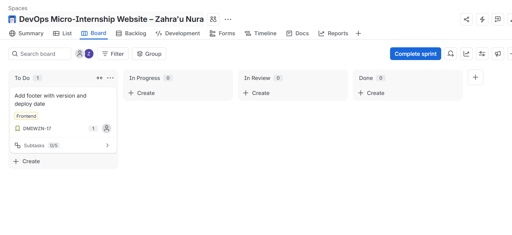

---

#### Screenshot 2 — Active Sprint board showing the Sprint Goal

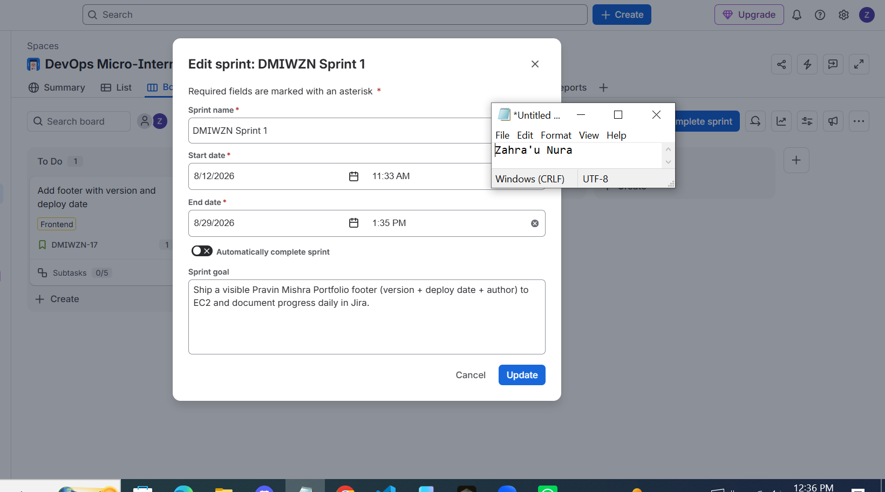

---

# Task 2 — Day 1: Implement the Footer, Commit, and Deploy

## Goal

Add the required footer text (`Pravin Mishra Portfolio v1.0 — Deployed on <DD Mon YYYY> — By <Student Name>`) to the site on a `feature/footer-v1` branch, commit it, and deploy it to the public EC2 URL.

### Evidence

#### Screenshot 3 — Jira board showing the Day 1 Sub-task in Done

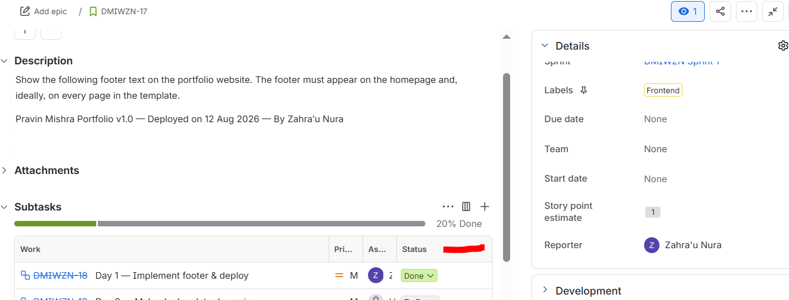

---

#### Screenshot 4 — Successful Git commit output

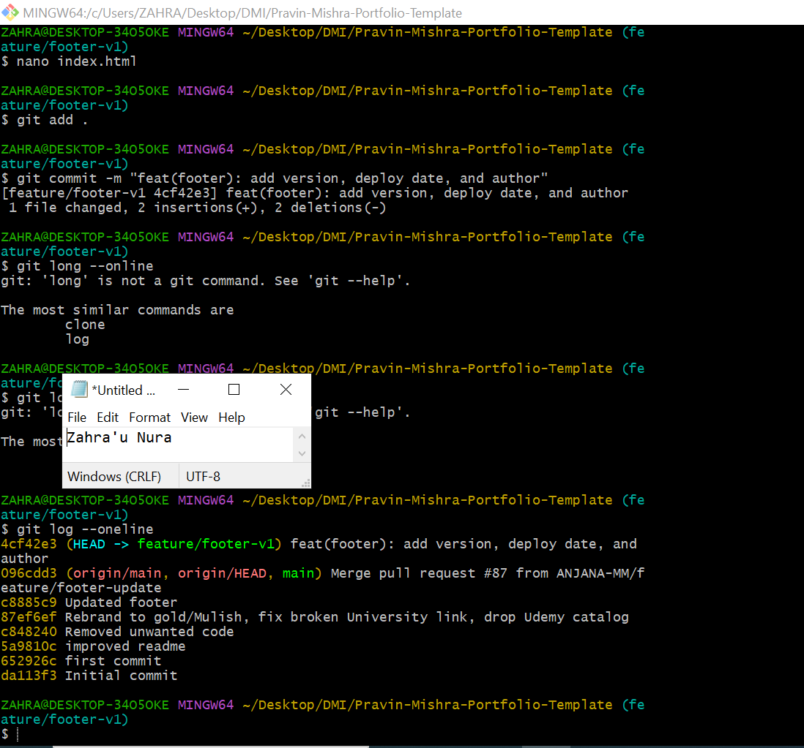

---

#### Screenshot 5 — EC2 browser view showing the complete footer text, with the URL visible

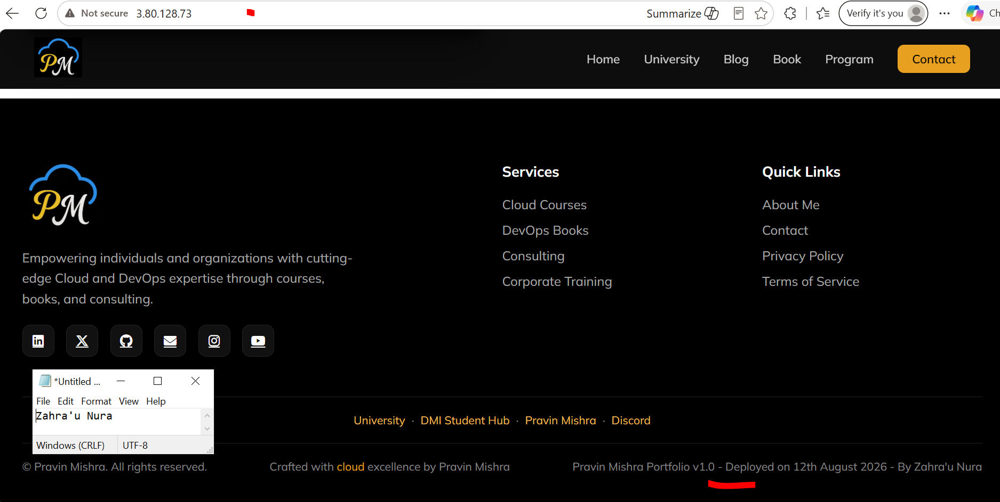

---

#### Screenshot 6 — Jira Story comment showing the Day 1 Daily Scrum update

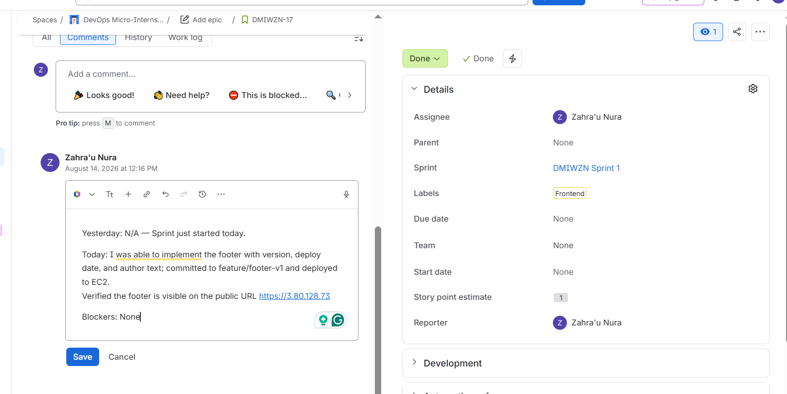

---

# Task 3 — Day 2: Make the Deploy Date Dynamic and Document It

## Goal

Update the footer so the deployment date is generated automatically (or updated consistently at deploy time), document the approach in `README.md`, commit, and redeploy.

### Evidence

#### Screenshot 7 — Code editor showing the footer and date logic or deployment-time template snippet

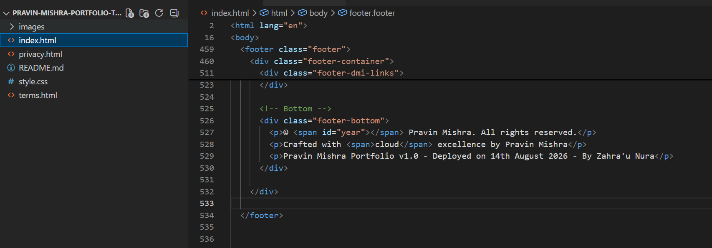

---

#### Screenshot 8 — EC2 browser view showing the updated footer with the current date

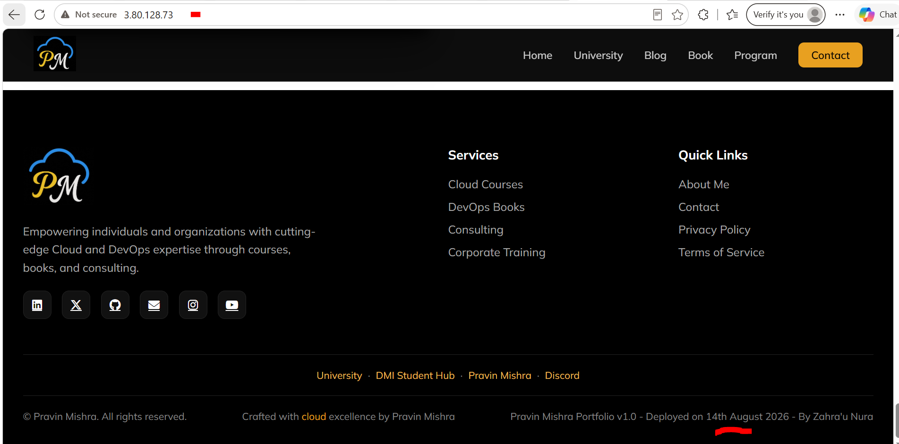

---

#### Screenshot 9 — README snippet documenting the footer and date behavior

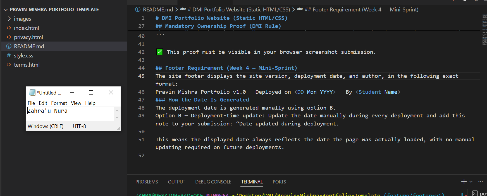

---

#### Screenshot 10 — Jira Story comment showing the Day 2 Daily Scrum update

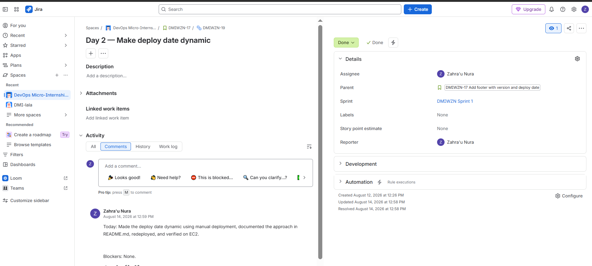

---

# Task 4 — Day 3: Polish the Footer and Validate Accessibility

## Goal

Improve the footer's spacing, contrast, and readability, then validate it at both desktop and mobile viewport widths.

### Evidence

#### Screenshot 11 — Desktop EC2 view showing the polished footer

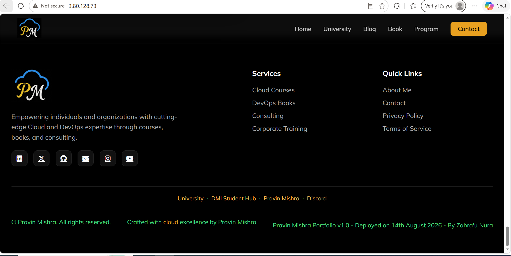

---

#### Screenshot 12 — Mobile responsive view showing the footer remains readable

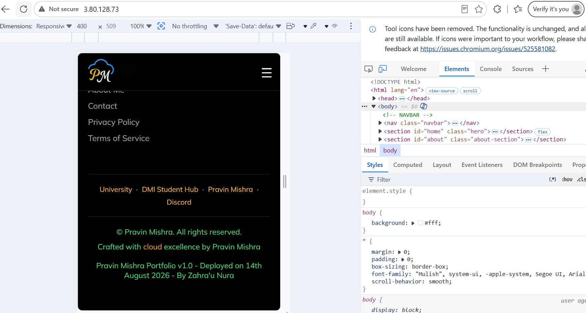

---

#### Screenshot 13 — Jira Story comment showing the Day 3 Daily Scrum update

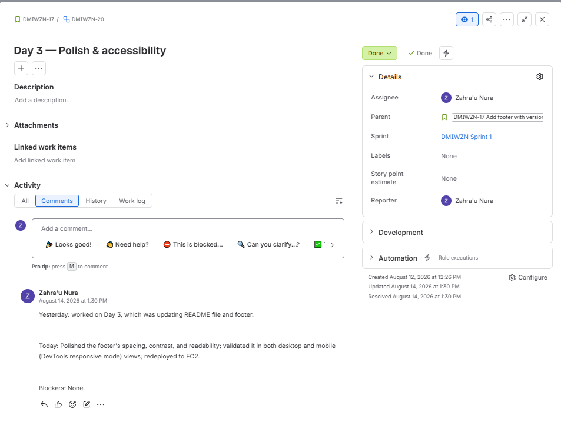

---

# Task 5 — Day 4: Change the Homepage Tagline / Call-to-Action

## Goal

Replace the existing homepage tagline with the required DMI Website call-to-action link and deploy it to EC2.

### Evidence

#### Screenshot 14 — EC2 browser view showing "Start your DevOps Journey here" and the clickable "Visit the DMI Website" link

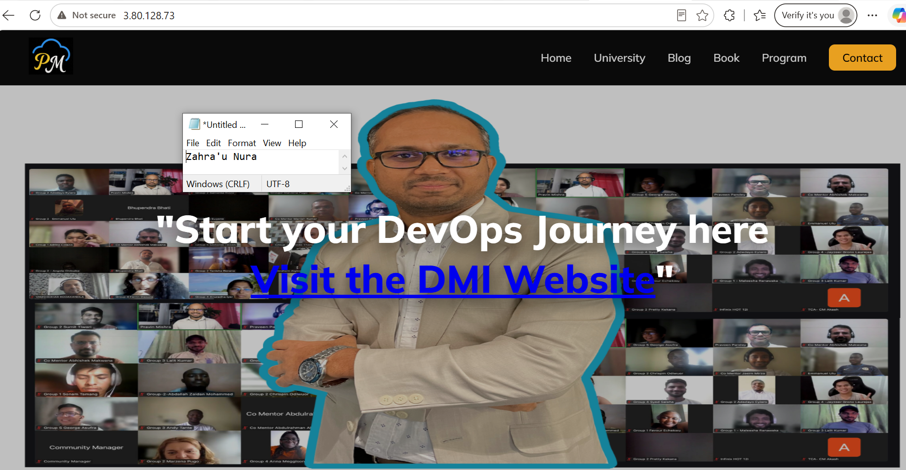

---

# Task 6 — Day 5: Demo, Retrospective, and Burndown

## Goal

Record a two-to-three-minute demo video of the shipped footer, add a retrospective comment (what went well, what to improve, one DevOps pillar observed), post the Day 5 Daily Scrum update, and open the Burndown Chart.

### Evidence

#### Screenshot 15 — Burndown Chart for Sprint 1

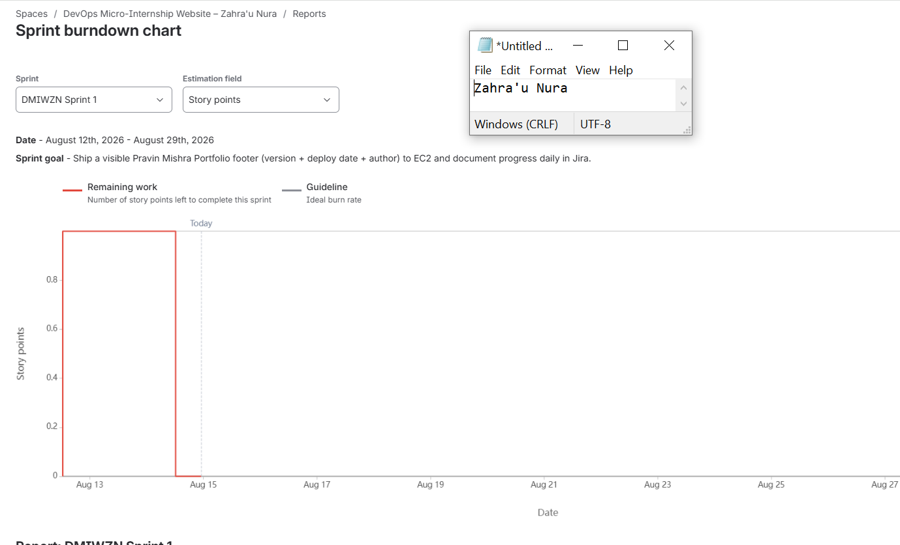

---

#### Screenshot 16 — Jira retrospective comment

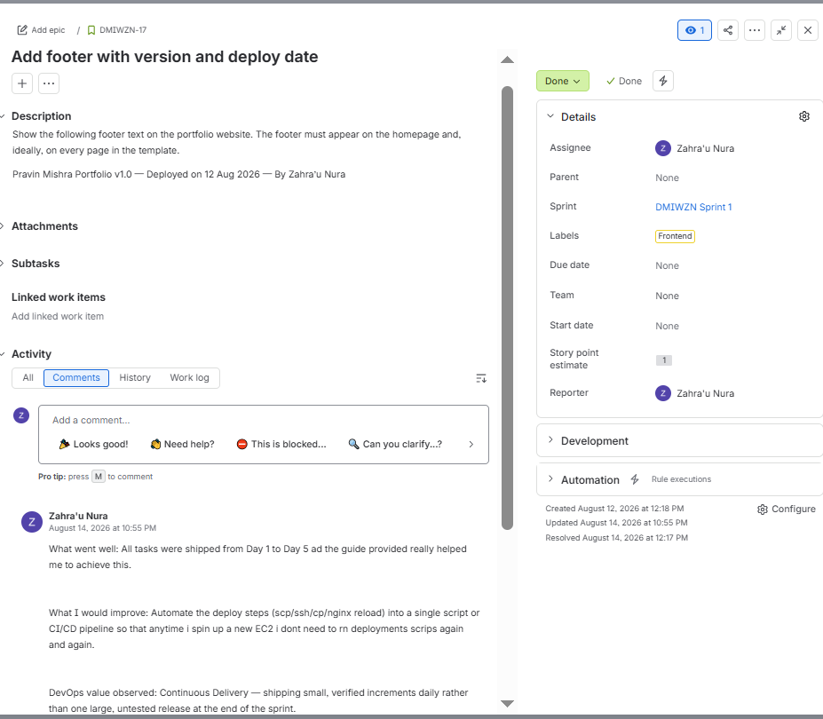

---

#### Screenshot 17 — Final EC2 browser view showing the complete footer requirement

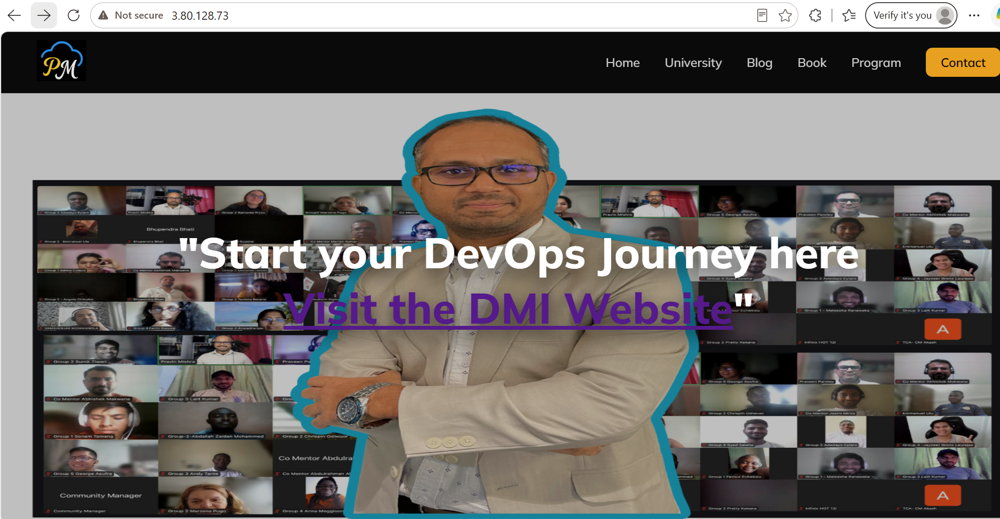

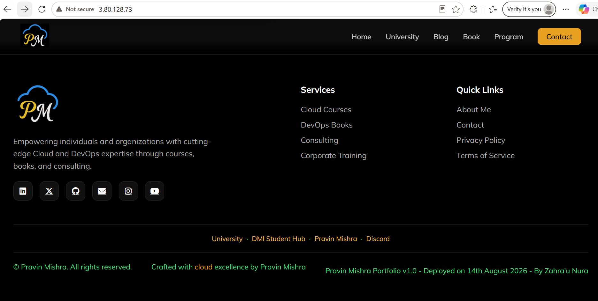

---

#### Demo Video URL

Paste your unlisted YouTube or accessible Google Drive demo-video link here:

`https://drive.google.com/file/d/16NHPh-URFMWCcTziP9FSf_AyRQ095AWW/view?usp=sharing`

---

# LinkedIn Post (Required)

## Goal

Publish a LinkedIn post about your five-day mini-Sprint, including your GitHub repository URL, your public EC2 live URL, three to five lines on what you shipped and learned, and one proof image (Burndown Chart, active Sprint board, or the EC2 footer).

## Evidence

#### LinkedIn Post URL

Paste your LinkedIn post URL here:

`https://www.linkedin.com/posts/zahra-u-nura_devops-agile-scrum-activity-7494360136136716288-P5J9?utm_source=share&utm_medium=member_desktop&rcm=ACoAABhheJ4Bw5LI3hMBUfCD5MZiGRXdKYKjr0U`

---

#### LinkedIn Screenshot 1 — Published LinkedIn post showing the post content and at least one required link or proof image

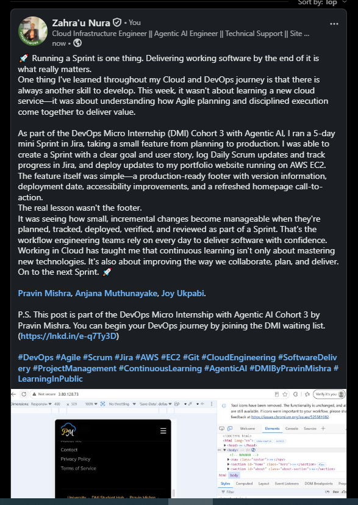

---

# Submission Instructions

- Add all 17 assignment screenshots in the specified order
- Add LinkedIn Screenshot 1
- Full name must be visible in required screenshots
- Include your two-to-three-minute demo-video URL
- Include Daily Scrum comments for Days 1–5 and the retrospective comment
- Include your GitHub repository URL and public EC2 live URL
- Do not expose sensitive information (private keys, passwords, tokens, account IDs)

---

# Completion Checklist

- [ ] Task 1: Sprint 1 started with the required Sprint Goal (Screenshots 1 & 2)
- [ ] Task 2: Day 1 footer implemented, committed, and deployed (Screenshots 3–6)
- [ ] Task 3: Day 2 deploy date made dynamic and documented (Screenshots 7–10)
- [ ] Task 4: Day 3 footer polished and validated on desktop and mobile (Screenshots 11–13)
- [ ] Task 5: Day 4 DMI Website call-to-action deployed and clickable (Screenshot 14)
- [ ] Task 6: Day 5 demo, retrospective, and Burndown evidence completed (Screenshots 15–17, video URL)
- [ ] Daily Scrum comments posted for Days 1–5
- [ ] LinkedIn post published with the GitHub URL, EC2 URL, required delivery details, and proof image
- [ ] LinkedIn Post URL and LinkedIn Screenshot 1 included
- [ ] Full Name visible in required screenshots
- [ ] No sensitive data exposed

---

## 📌 About DMI & CloudAdvisory

DevOps Micro Internship (DMI) is a project-based DevOps program run by Pravin Mishra (The CloudAdvisory) focused on real-world execution, systems thinking, and career readiness.

It helps learners build strong DevOps foundations with hands-on experience.

---

## 📌 Resources

- 🌐 DMI Official Website: https://dmi.pravinmishra.com?utm_source=github&utm_medium=readme  
- 🎓 University: https://university.pravinmishra.com?utm_source=github&utm_medium=readme  
- 💬 Discord Community: https://discord.pravinmishra.com?utm_source=github&utm_medium=readme  
- 📝 Blog: https://dmi.pravinmishra.com/blog?utm_source=github&utm_medium=readme  
- ▶️ YouTube Playlist: https://www.youtube.com/playlist?list=PLFeSNDtI4Cho  
- 🔗 Pravin Mishra (LinkedIn): https://www.linkedin.com/in/pravin-mishra-aws-trainer/  
- 🏢 CloudAdvisory (LinkedIn): https://www.linkedin.com/company/thecloudadvisory/

---

*This submission is part of DevOps Micro Internship (DMI) Cohort 3 — Agentic AI Track.*
