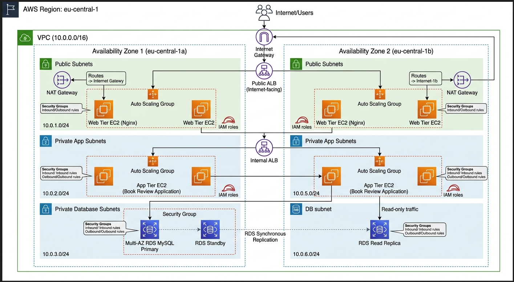
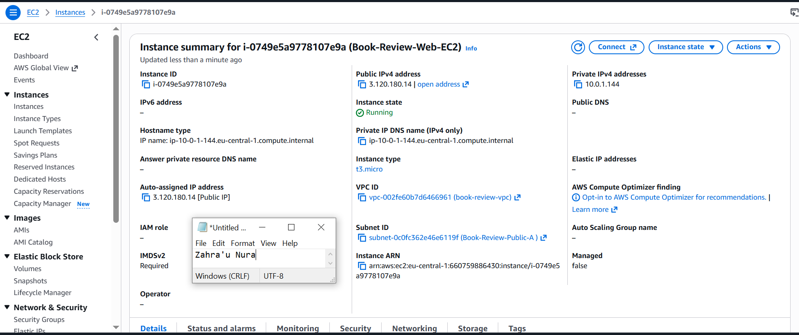
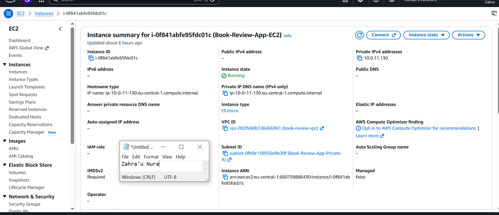
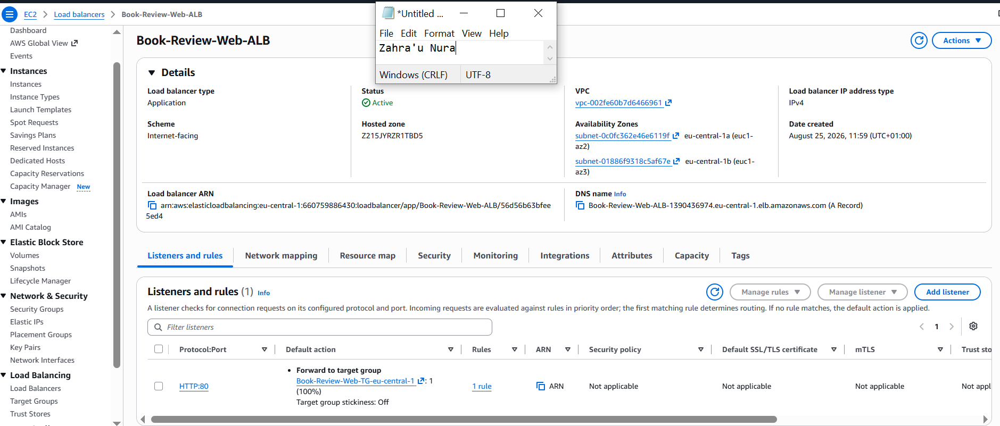
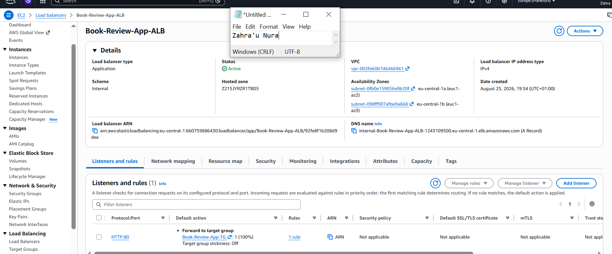
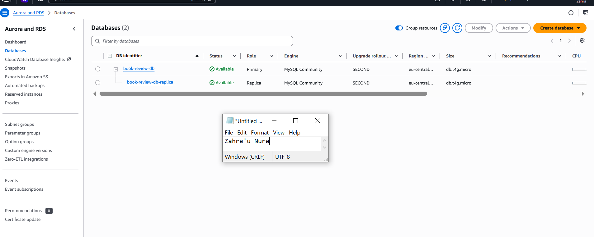
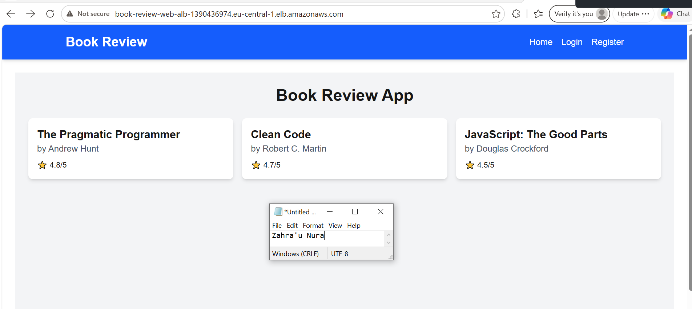
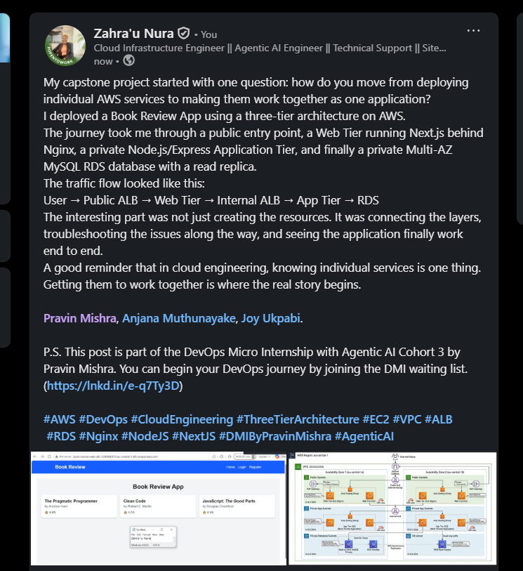

# Assignment 6 — Capstone Assignment — Deploy Book Review App (Three-Tier Architecture) on AWS

Part of the DevOps Micro Internship (DMI) Cohort 3 with Agentic AI

---

## Purpose

This is the most important assignment of the course. You will deploy the Book Review App in a fully production-style three-tier architecture on AWS: a Next.js Web Tier behind Nginx and a public ALB, a private Node.js/Express App Tier behind an internal ALB, and a private Multi-AZ MySQL RDS database with a read replica. You are expected to design, deploy, isolate, debug, and document the result independently.

---

# Task 1 — Architecture Diagram

## Goal

Create an architecture diagram showing the custom VPC (10.0.0.0/16), the six subnets across two Availability Zones (two public Web Tier, two private App Tier, two private Database Tier), the public ALB, Web Tier EC2/Nginx, internal ALB, private App Tier EC2, private Multi-AZ RDS with its read replica, and the permitted traffic flow.

### Evidence

#### Diagram image or link

---

# Task 2 — AWS Region & Services Used

## Goal

Record the AWS Region used and list every AWS service used across networking, compute, load balancing, security, and the database.

### Notes

**Region:**

Europe (Frankfurt): eu-central-1.

---

**Services:**

Amazon VPC (Virtual Private Cloud), Subnets, Internet Gateway (IGW), NAT Gateways, Route Tables, Amazon EC2 (Elastic Compute Cloud), AWS Auto Scaling Groups, Application Load Balancer (Public / Internet-Facing ALB), Application Load Balancer (Internal ALB), Amazon RDS (Relational Database Service), Amazon RDS Read Replica, Security Groups, AWS IAM (Identity and Access Management).

---

# Task 3 — Public Entry Point

## Goal

Confirm the Book Review App loads through the public ALB DNS name.

### Evidence

#### Public ALB DNS

Paste your public ALB DNS name here:

`Book-Review-Web-ALB-1390436974.eu-central-1.elb.amazonaws.com`

---

# Task 4 — Evidence Screenshots

## Goal

Capture visual proof of every tier and load balancer.

### Evidence

#### Web EC2

---

#### App EC2

---

#### Public ALB

---

#### Internal ALB

---

#### RDS + Replica

---

#### App UI proof

---

# Task 5 — Summary

## Goal

Summarize what worked in the final deployment, the issues encountered and how each was fixed, and the tools or sources used to research and debug.

### Notes

**What worked:**

The full HA architecture deployed successfully — VPC with public/app/private subnets across two AZs, NAT Gateway, IGW, three-tier security group chain, RDS MySQL with Multi-AZ, an Internet-facing ALB in front of the Web tier, an Internal ALB in front of the App tier, Nginx as a reverse proxy on the Web EC2, and the backend/frontend both running persistently under PM2. End-to-end request flow (Public ALB → Web EC2/Nginx → Internal ALB → App EC2 → RDS) was verified working via curl at each layer and confirmed in the browser.

---

**Issues + fixes:**

DB connection failed after WordPress-style setup → RDS security group source was misconfigured; corrected to allow MySQL/3306 only from the App tier's security group, not the Web tier's.
Couldn't SSH from Web EC2 to App EC2 (hung, no response) → App tier security group's SSH rule was sourced from "My IP" instead of the Web tier's security group; fixed to trust the bastion (Web-SG) as the source.
mysql login worked but Unknown database error → the application database was never created; fixed by manually running CREATE DATABASE.
WordPress login lost/forgotten → reset directly via SQL (UPDATE wp_users SET user_pass = MD5(...)) since no SMTP was configured for password-reset emails.
Target group showing Unhealthy (HTTP 302) → WordPress hadn't completed its install wizard yet, so / redirected instead of returning 200; fixed by completing the install once through a temporarily-opened direct instance IP.
PM2 backend stuck in "errored" crash-loop → a manually-started node process was still holding port 3001 (EADDRINUSE); killed the stray process and let PM2 own the port.
/api/api/books double-path bug → frontend code re-appended /api on top of an already-prefixed NEXT_PUBLIC_API_URL; fixed by removing the duplicate /api in the fetch call and rebuilding.
Persistent 504 Gateway Timeout on /api/books → traced through target-group health, security groups, and PM2 status (all healthy) down to Nginx's proxy_pass pointing at the wrong hostname — the Internal ALB had mistakenly been created with an Internet-facing scheme instead of Internal, so it never got AWS's internal- DNS prefix. Fixed by deleting and recreating the ALB with the correct Internal scheme in the private app subnets, then updating Nginx's proxy_pass to the new DNS name.

---

**Tools/sources used:**

AWS Management Console (EC2, VPC, RDS, target groups, load balancers), SSH/bastion access, curl, mysql CLI, pm2 (status/logs), Nginx config testing (nginx -t), browser DevTools (Network/Console tabs) for isolating the frontend fetch and CORS/path issues, and AWS CLI (describe-load-balancers) to confirm ALB scheme independent of a cropped console screenshot.

---

# LinkedIn Post (Required)

## Goal

Publish a LinkedIn post sharing the capstone deployment, including the public ALB DNS (or a redacted screenshot), three to five lines on what you built and why it is production-style, and one proof screenshot.

## Evidence

#### LinkedIn Post URL

Paste your LinkedIn post URL here:

`https://www.linkedin.com/posts/zahra-u-nura_aws-devops-cloudengineering-activity-7498490230392475650-S30F?utm_source=share&utm_medium=member_desktop&rcm=ACoAABhheJ4Bw5LI3hMBUfCD5MZiGRXdKYKjr0U`

---

#### Screenshot of LinkedIn post

---

# Submission Instructions

- Add all required screenshots and links in your submission
- Do not expose passwords, RDS credentials, connection strings, private keys, or account IDs

---

# Completion Checklist

- [ ] Task 1: Architecture diagram completed
- [ ] Task 2: AWS Region and services documented
- [ ] Task 3: Public ALB DNS confirmed working
- [ ] Task 4: All six evidence screenshots captured (Web Tier, App Tier, both ALBs, RDS + replica, app UI)
- [ ] Task 5: Deployment summary completed (what worked, issues/fixes, tools/sources)
- [ ] LinkedIn post published and URL submitted
- [ ] App Tier and Database Tier confirmed not publicly accessible
- [ ] No sensitive data exposed

---

## 📌 About DMI & CloudAdvisory

DevOps Micro Internship (DMI) is a project-based DevOps program run by Pravin Mishra (The CloudAdvisory) focused on real-world execution, systems thinking, and career readiness.

It helps learners build strong DevOps foundations with hands-on experience.

---

## 📌 Resources

- 🌐 DMI Official Website: https://dmi.pravinmishra.com?utm_source=github&utm_medium=readme  
- 🎓 University: https://university.pravinmishra.com?utm_source=github&utm_medium=readme  
- 💬 Discord Community: https://discord.pravinmishra.com?utm_source=github&utm_medium=readme  
- 📝 Blog: https://dmi.pravinmishra.com/blog?utm_source=github&utm_medium=readme  
- ▶️ YouTube Playlist: https://www.youtube.com/playlist?list=PLFeSNDtI4Cho  
- 🔗 Pravin Mishra (LinkedIn): https://www.linkedin.com/in/pravin-mishra-aws-trainer/  
- 🏢 CloudAdvisory (LinkedIn): https://www.linkedin.com/company/thecloudadvisory/

---

*This submission is part of DevOps Micro Internship (DMI) Cohort 3 — Agentic AI Track.*