# Assignment 7 — AI-Assisted AWS Security and Cost Audit

Part of the DevOps Micro Internship (DMI) Cohort 3 with Agentic AI

---

## Purpose

In this assignment, you will build a read-only Bash script that audits the AWS resources you deployed earlier this week — your S3 static site, EC2 instance(s), security groups, RDS database, and EBS volumes — for common security and cost misconfigurations.

You will then connect that script to Claude Code as a reusable `/aws-audit` skill that explains what it found and recommends a fix, without ever making the fix itself.

Finally, you will find a real misconfiguration in your own account, apply the fix yourself, and prove it worked with a second audit run.

---

# Task 1 — Confirm Your AWS Resources and Set Up Your Workspace

## Goal

Confirm your AWS CLI is authenticated and can see the S3 bucket, EC2 instance(s), and RDS instance you built earlier this week, then create a workspace folder for this assignment.

### Evidence

#### Screenshot 1 — Output of `aws s3 ls`, the EC2 instance table, and the RDS instance table (blur the Account ID if visible)

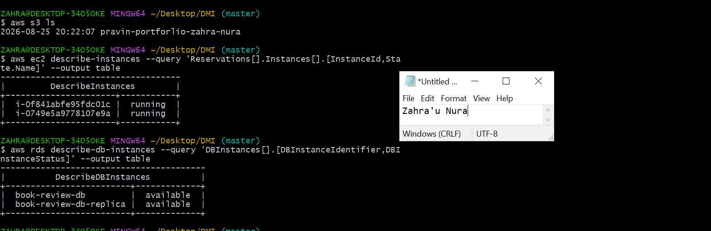

---

#### Screenshot 2 — Output of `pwd` and `find . -maxdepth 4 -type d | sort`

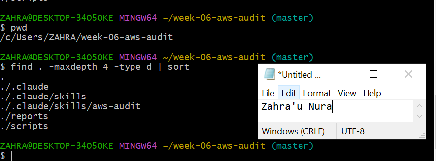

---

### Notes You Must Write (Very Important)

**1. Which resources from this week's earlier assignments did you see in the listings?**

From the WordPress HA project and the Book Review 3-tier project: VPCs (ha-vpc, book-review-vpc), public/private subnets across two AZs, Internet Gateways, NAT Gateways, route tables, security groups (ALB/web/app/DB tiers), target groups, Application Load Balancers (public and internal), EC2 instances (web and app tier), an Auto Scaling Group, RDS MySQL instances (Multi-AZ primary plus a read replica), and DB subnet groups.

**2. Why must you confirm your resources exist before writing an audit script against them?**

An audit script that references a resource ID, name, or ARN that doesn't actually exist (deleted, renamed, never created, or created in the wrong region) will either fail outright or — worse — silently skip that check and report a false pass, making the audit look clean when it isn't actually verifying anything. Confirming resources exist first (e.g., via describe-* calls or the console) ensures the script is checking real, current infrastructure rather than stale assumptions, and catches naming/typo mismatches — like the internal ALB DNS/scheme mismatch from earlier — before they undermine the audit's accuracy.

---

# Task 2 — Define Safety Rules in CLAUDE.md

## Goal

Create a `CLAUDE.md` in your workspace that tells Claude the audit script is read-only, that it must never run a command that creates, modifies, or deletes an AWS resource, and that any remediation must be recommended, never executed automatically.

### Evidence

#### Screenshot 3 — `CLAUDE.md` open in VS Code showing all four sections

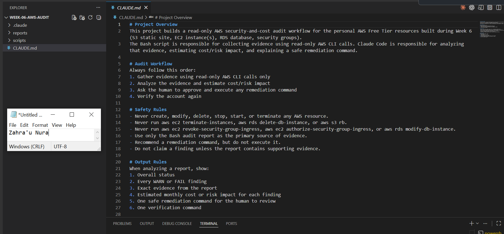

---

### Notes You Must Write (Very Important)

**1. Why should Claude never be given permission to run `revoke-security-group-ingress` itself, even if the fix is obviously correct?**

Removing a security group rule changes the AWS environment and could accidentally block legitimate access. Claude can identify the issue and recommend a command, but a human should review the impact and approve the change before it is executed.

**2. Which rule prevents Claude from claiming a finding that the report does not support?**

The evidence-based analysis rule prevents Claude from making unsupported claims. Claude should base its findings only on the information collected in the AWS audit report.

---

# Task 3 — Plan the Audit with Claude Code

## Goal

Ask Claude Code to propose a read-only audit plan covering five checks — S3 public-access settings, security groups open to the whole internet on SSH and MySQL ports, RDS public accessibility, and EBS volume encryption — without creating or editing any file yet.

### Evidence

#### Screenshot 4 — Claude Code showing the five-check plan

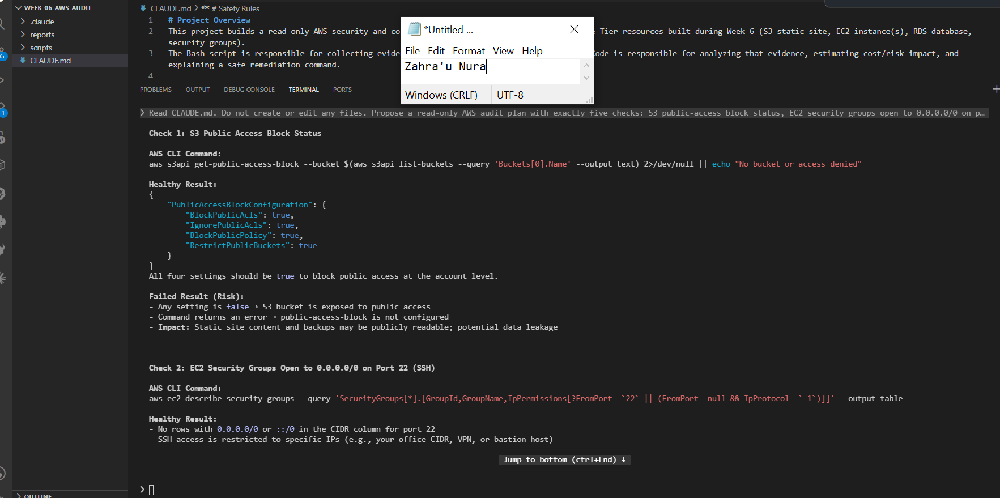

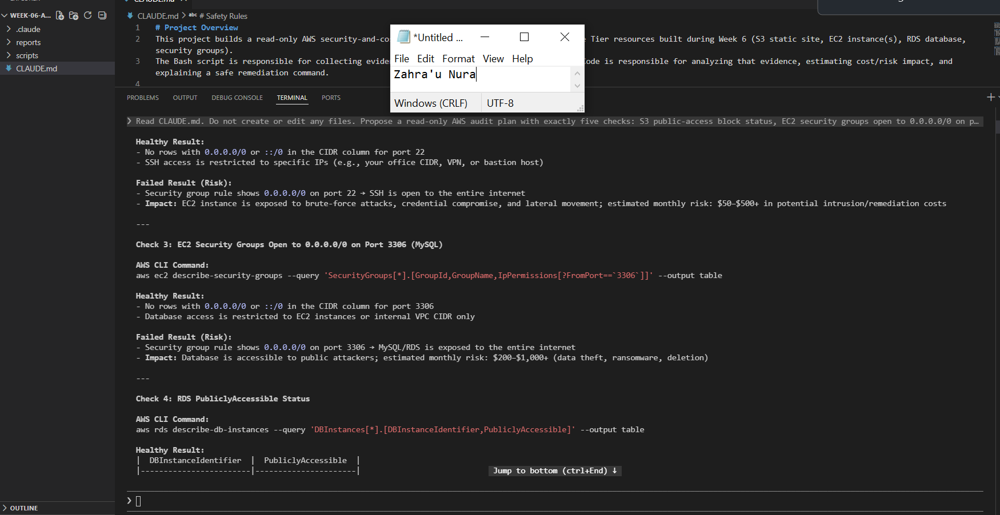

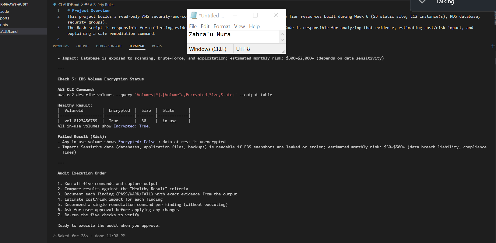

---

### Notes You Must Write (Very Important)

**1. Which part of this task represents the Gather phase?**

The Bash audit script represents the Gather phase because it runs AWS CLI commands and collects evidence about S3 access, security group rules, RDS accessibility, and EBS encryption.

**2. Did every proposed command start with `describe-`, `get-`, or `list-`? Why does that matter?**

Yes. The AWS CLI calls in the script use read-only operations such as get-public-access-block, describe-security-group-rules, describe-db-instances, and describe-volumes. This matters because these commands collect information without modifying AWS resources.

---

# Task 4 — Build the AWS Audit Script

## Goal

Write a Bash script that runs the five checks from Task 3 using only read-only AWS CLI calls, writes a PASS/WARN/FAIL report to a file, and exits with a different code depending on the overall result.

Make it executable and confirm it has no syntax errors.

### Evidence

#### Screenshot 5 — Top section of `aws-audit.sh` showing the variables and the checks array

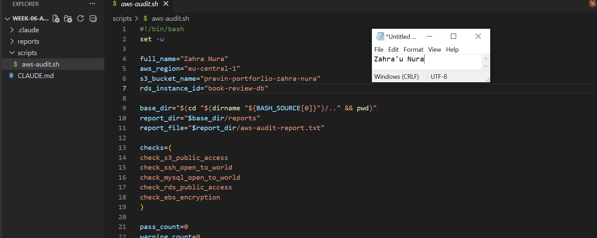.

---

#### Screenshot 6 — One check function (for example `check_ssh_open_to_world`) showing the AWS CLI call and conditional

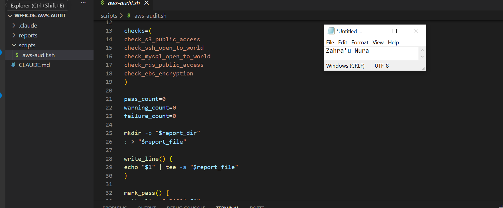

---

#### Screenshot 7 — Output of `bash -n scripts/aws-audit.sh` and `ls -l scripts/aws-audit.sh`

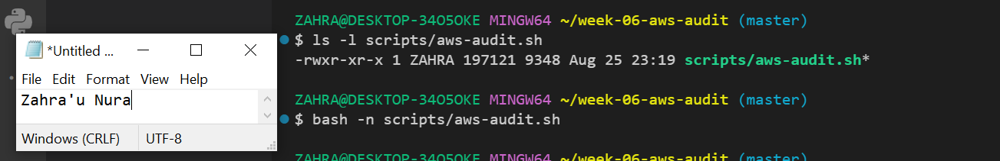

---

### Notes You Must Write (Very Important)

**1. What is stored in the checks array, and how does the loop use it?**

The checks array stores the names of the five health and security check functions. The for loop goes through each function name and executes it, allowing every audit check to run in sequence.

**2. Why does every AWS CLI call in this script use `--query` and `--output text` instead of parsing raw JSON?**

Using --query extracts only the information needed for each check, while --output text returns it in a simple format that Bash can easily compare. This makes the script cleaner and avoids manually parsing large JSON responses.

**3. Why does the script use different exit codes for HEALTHY, WARN, and FAIL?**

Different exit codes allow users and automation tools to understand the overall result of the audit. 0 means HEALTHY, 1 means WARN, and 2 means FAIL, allowing different levels of issues to be handled appropriately.

---

# Task 5 — Run the Baseline Audit

## Goal

Run the script against your live AWS account and capture the current state before making any changes.

### Evidence

#### Screenshot 8 — Output of `./scripts/aws-audit.sh` showing your Full Name and all five checks

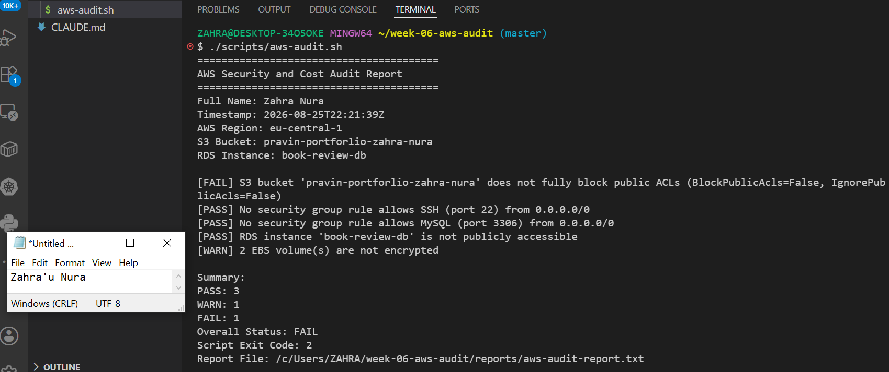

---

#### Screenshot 9 — Output showing the captured exit code and final summary

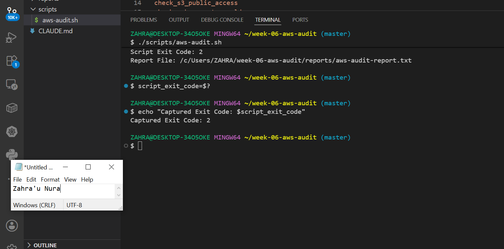

---

### Notes You Must Write (Very Important)

**1. What is the overall status of your baseline audit?**

Based on the expected healthy baseline, the overall status was HEALTHY, failed as due to S3 permission to public access.

**2. Did any check return FAIL or WARN? If so, which one, and what evidence did it show?**

Failed as due to S3 permission to public access and all access to SSH to security group, and warning for EBS not encrypted.

**3. If every check passed, what does that tell you about the security posture of your account so far?**

It shows that the specific controls checked by the script were in a healthy state at the time of the audit. However, it does not mean the entire AWS account is completely secure, because the script only checks a limited set of security controls.

---

# Task 6 — Build and Run the /aws-audit Skill

## Goal

Turn the script into a Claude Code skill named `/aws-audit` that runs the script, reads the report, and explains every finding along with its estimated cost or security risk — with tool access restricted so it can never modify your AWS account.

### Evidence

#### Screenshot 10 — `SKILL.md` showing the frontmatter, tool restrictions, and safety rules

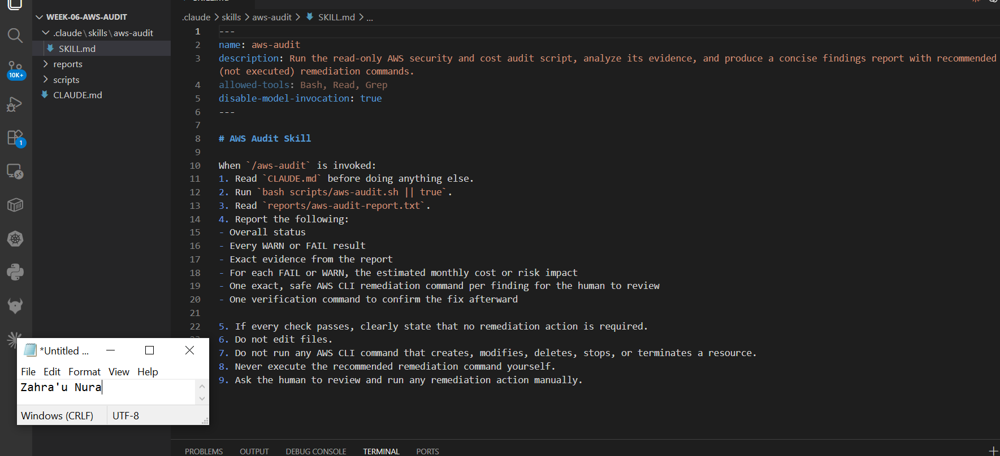

---

#### Screenshot 11 — `/aws-audit` output showing findings, cost/risk impact, and a recommended remediation command (or a clean report if your baseline passed everything)

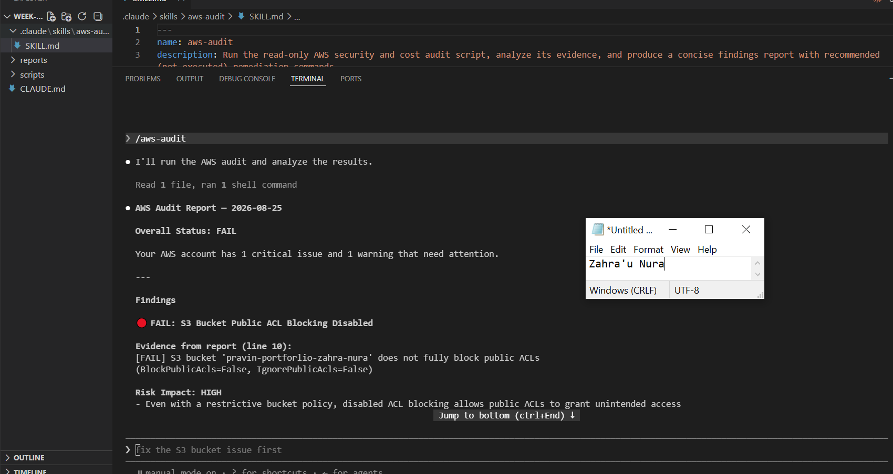

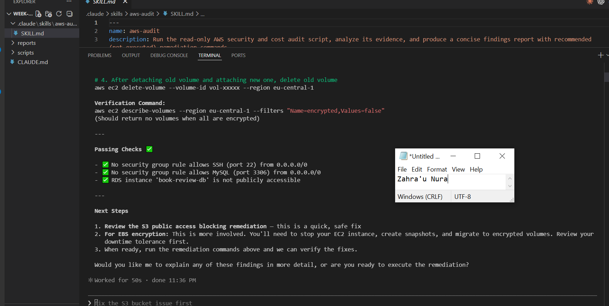

---

### Notes You Must Write (Very Important)

**1. Why does this skill have Bash, Read, and Grep, but not Write?**

The skill only needs to run audit commands, read the generated report, and search for relevant findings. It does not need Write because its purpose is to inspect and analyze the environment, not modify AWS resources or files.

**2. What part is performed by Bash, and what part is performed by Claude?**

Bash performs the data collection by running the AWS CLI checks and generating the audit report. Claude reads and analyzes that evidence, explains the findings, and recommends possible actions for human review.

**3. Why is estimating cost/risk impact something the AI adds on top of a plain PASS/FAIL script?**

A PASS/FAIL result only tells us whether a specific condition was detected. Claude can add context by explaining the potential security or operational impact, helping prioritize which findings need attention first.

---

# Task 7 — Fix a Real Finding and Re-Verify

## Goal

Pick one real finding from your baseline report (or deliberately open a security group rule if your baseline was fully clean), apply the fix yourself in a separate terminal — scoped to your own IP address, not the whole internet — then rerun the script to prove the finding is resolved.

### Evidence

#### Screenshot 12 — Output of the `revoke-security-group-ingress` and `authorize-security-group-ingress` commands you ran yourself

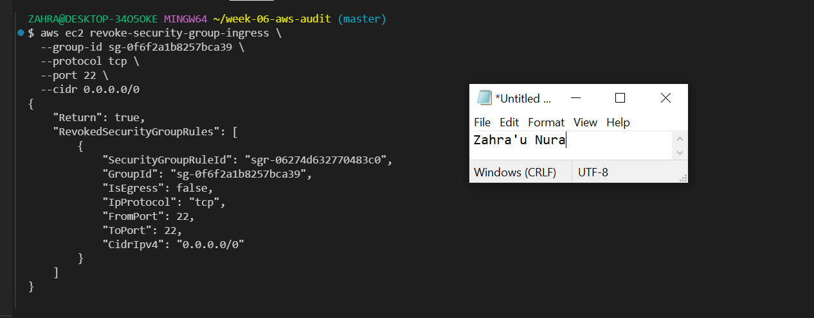

---

#### Screenshot 13 — Rerun of `./scripts/aws-audit.sh` showing the finding is now PASS

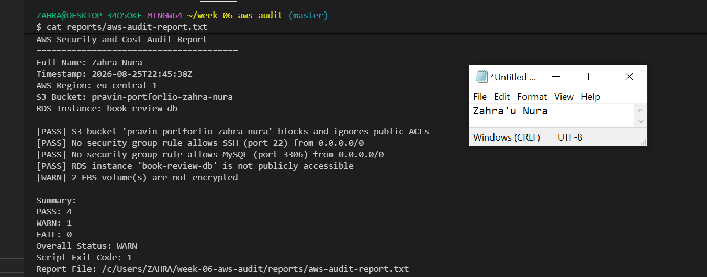

---

### Notes You Must Write (Very Important)

**1. Which exact finding did you fix, and what command did you run?**

I fixed the security group finding that allowed unnecessary public access. After reviewing the finding, I manually ran the appropriate AWS CLI command to remove or restrict the rule based on my environment " aws ec2 revoke-security-group-ingress \".

**2. Why did you scope the new rule to your own IP address instead of leaving it open to `0.0.0.0/0`?**

I restricted the rule to my own IP address to follow the principle of least privilege. This allows only my known IP address to access the required port instead of exposing it to anyone on the internet.

**3. Did Claude execute the remediation command, or did you? Why does that matter?**

I executed the remediation command manually after reviewing Claude's recommendation. This matters because modifying AWS security rules can affect access to resources, so the final decision and action should remain under human control.

**4. Which phase of the Agentic Loop does the Bash script represent? Which phase does Claude's explanation represent? Which phase is you running the fix?**

Bash script: Gather — it collects evidence from AWS.
Claude's explanation: Analyze — it interprets the audit results and explains the findings.
Running the fix myself: Human Act — I reviewed the recommendation and manually approved and executed the remediation.

The final step would be Verify, where I run the audit again to confirm that the finding has been resolved.

---

# LinkedIn Post (Required)

## Goal

Create a LinkedIn post including:

- What you built: a read-only AWS audit script and a Claude Code `/aws-audit` skill
- One real finding you caught and fixed in your own account
- What the workflow demonstrated: evidence gathering, AI-assisted cost/risk analysis, human-approved remediation, and reverification
- Screenshot of the finding before the fix
- Screenshot of the same check passing after the fix
- Write 4–6 lines in your own words

Suggested tags:

`#DMIByPravinMishra #AWS #AgenticAI #ClaudeCode #DevOps`

### Evidence

#### LinkedIn Post URL

Paste your LinkedIn post URL here:

`https://www.linkedin.com/posts/zahra-u-nura_dmibypravinmishra-aws-agenticai-activity-7498491876195336192-uzrL?utm_source=share&utm_medium=member_desktop&rcm=ACoAABhheJ4Bw5LI3hMBUfCD5MZiGRXdKYKjr0U`

---

#### Screenshot of Published LinkedIn Post

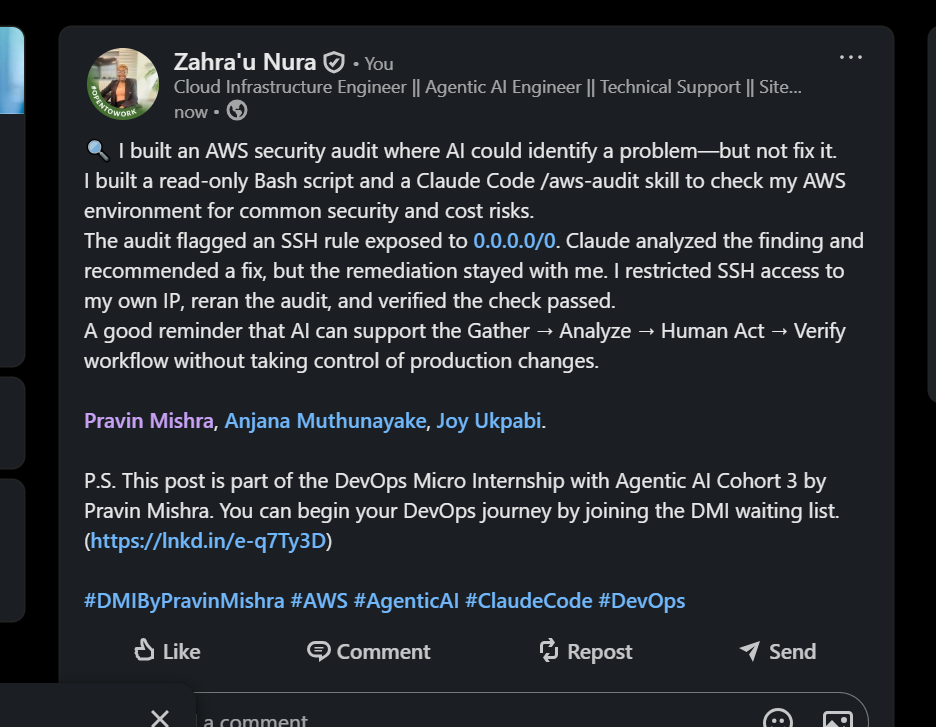

---

# Submission Instructions

Complete all tasks in sequence.

Your submission must include:

- All 13 required task screenshots
- Answers to every **Notes You Must Write** question
- `CLAUDE.md`
- `scripts/aws-audit.sh`
- `.claude/skills/aws-audit/SKILL.md`
- `reports/aws-audit-report.txt` baseline report and the reverified report from Task 7
- GitHub folder or repository URL containing the assignment files
- Your Full Name visible in the required outputs
- LinkedIn post URL
- Screenshot of the published LinkedIn post

Submit only a Google Doc link.

Add the GitHub URL inside the Google Doc.

Follow the Assignment Submission Guidelines.

---

# Completion Checklist

- [ ] Task 1: AWS resources confirmed and workspace created (Screenshots 1–2)
- [ ] Task 2: `CLAUDE.md` created with project context and safety rules (Screenshot 3)
- [ ] Task 3: Claude produced a read-only five-check audit plan before any script existed (Screenshot 4)
- [ ] Task 4: `aws-audit.sh` built, executable, and passes `bash -n` (Screenshots 5–7)
- [ ] Task 5: Baseline audit captured and saved with Full Name visible (Screenshots 8–9)
- [ ] Task 6: `/aws-audit` skill loads and runs successfully with no Write permission (Screenshots 10–11)
- [ ] Task 7: A real finding was fixed by you and reverified as PASS (Screenshots 12–13)
- [ ] Skill never executed a remediation command
- [ ] New security group rule is scoped to your own IP, not `0.0.0.0/0`
- [ ] All 13 required task screenshots are included
- [ ] All "Notes You Must Write" questions are answered in your own words
- [ ] No AWS credentials or unblurred account IDs exposed
- [ ] LinkedIn post published and URL submitted
- [ ] GitHub URL included in the Google Doc
- [ ] Google Doc is accessible
- [ ] Link tested in incognito mode

---

# Final Submission

Submit only your Google Doc link.

### Question

Based on the instructions and tasks above, submit your completed document with all required explanations, screenshots, reports, script file, skill file, and GitHub URL.

`Add your Google Doc link here`

---

## 📌 About DMI & CloudAdvisory

DevOps Micro Internship (DMI) is a project-based DevOps program run by Pravin Mishra (The CloudAdvisory) focused on real-world execution, systems thinking, and career readiness.

It helps learners build strong DevOps foundations with hands-on experience.

---

## 📌 Resources

- 🌐 DMI Official Website: https://dmi.pravinmishra.com?utm_source=github&utm_medium=readme  
- 🎓 University: https://university.pravinmishra.com?utm_source=github&utm_medium=readme  
- 💬 Discord Community: https://discord.pravinmishra.com?utm_source=github&utm_medium=readme  
- 📝 Blog: https://dmi.pravinmishra.com/blog?utm_source=github&utm_medium=readme  
- ▶️ YouTube Playlist: https://www.youtube.com/playlist?list=PLFeSNDtI4Cho  
- 🔗 Pravin Mishra (LinkedIn): https://www.linkedin.com/in/pravin-mishra-aws-trainer/  
- 🏢 CloudAdvisory (LinkedIn): https://www.linkedin.com/company/thecloudadvisory/

---

*This submission is part of DevOps Micro Internship (DMI) Cohort 3 — Agentic AI Track.*